# Tổng Quan về Balancy

Balancy là một nền tảng cung cấp các công cụ toàn diện để quản lý và vận hành game. Từ việc thiết lập cấu trúc dữ liệu, quản lý tài nguyên, vật phẩm, cho đến việc triển khai các chiến dịch LiveOps phức tạp như sự kiện, ưu đãi cá nhân hóa và cửa hàng trong game. Mục tiêu chính của Balancy là trao quyền cho các nhà thiết kế và nhà phân tích, cho phép họ điều chỉnh logic game từ xa một cách trực quan, giảm thiểu sự phụ thuộc vào đội ngũ kỹ sư và tăng tốc quá trình phát triển.

## 1. Core Data Structure

Nền tảng của việc quản lý game trong Balancy bắt đầu bằng việc định nghĩa cấu trúc dữ liệu.

### **Templates**
Templates mô tả cấu trúc và hành vi của các đối tượng trong game như Vật phẩm, Quái vật, hoặc Công trình. Đối với lập trình viên, một Template có thể được xem như một `class`.
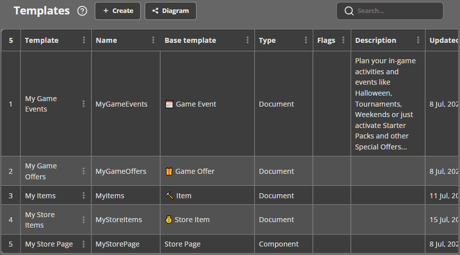

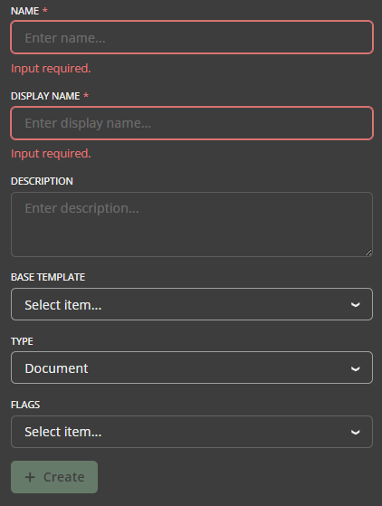

* **Thuộc tính chính của Template:**
    * **Name:** Tên dùng để tạo mã code, nên theo quy ước CamelCase (ví dụ: `ItemModel`, `MonsterData`).
    * **Display Name:** Tên hiển thị trong giao diện Balancy để dễ nhận biết (ví dụ: "Item Model").
    * **Base Template:** Cho phép một Template kế thừa từ một Template khác.
    * **Type:**
        * **Document:** Loại mặc định, cho phép tạo nhiều thực thể (ví dụ: nhiều loại kiếm khác nhau).
        * **Component:** Luôn được nhúng vào các Document khác (ví dụ: một Template `Vector3` để lưu vị trí).
        * **Singleton:** Chỉ có một thực thể duy nhất, thường dùng cho các trang cài đặt và cấu hình chung.
    * **Description:** Mô tả mục đích của Template cho các thành viên trong nhóm.

### **Parameters**
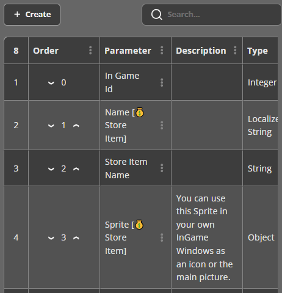

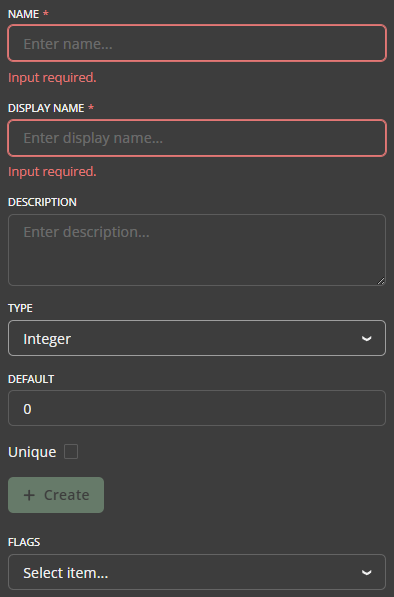

Sau khi tạo Template, bạn có thể thêm các tham số (Parameters) vào đó. Mỗi tham số có các thuộc tính sau:
* **Name:** Tên được sử dụng trong code (ví dụ: `HeroType`).
* **Display Name:** Tên hiển thị trên giao diện Balancy (ví dụ: "Hero Type").
* **Default Value:** Giá trị mặc định khi tạo một Document mới.
* **Type:** Balancy hỗ trợ nhiều kiểu dữ liệu, bao gồm:
    * **Number:** `Integer`, `Float`, `Duration` (số nguyên với giao diện ngày/giờ/phút/giây).
    * **Logic:** `Boolean` (true/false).
    * **Text:** `String`.
    * **Selection:** `Enum` (chọn từ các giá trị được định nghĩa trước).
    * **Reference:** `Document` (tham chiếu đến một Document khác), `Asset` (tham chiếu đến Addressable), `Sprite` (tham chiếu đến hình ảnh trên CDN), `Product` (tham chiếu đến sản phẩm IAP).
    * **Collection:** `List` (một mảng các giá trị).
    * **Time:** `Date Time`.

### **Enums**
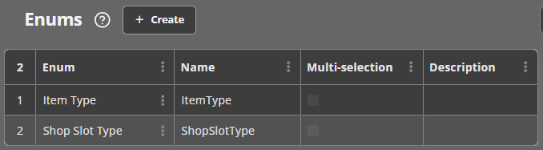

Enums cho phép bạn sử dụng các giá trị có tên gọi ý nghĩa thay vì các con số (ví dụ: `Color.Blue` thay vì `2`). Bạn có thể cấu hình Tên, Mô tả, và cho phép một tham số có thể chứa nhiều giá trị Enum cùng lúc (Multi-selection).

## 2. Assets Management

Balancy cung cấp các công cụ để quản lý tài nguyên trong game, được gọi chung là Assets.

* **Addressables:** Là các tài nguyên trong Unity (ví dụ: prefab, sprite) được Balancy lưu trữ và phân phối thông qua CDN. Điều này cho phép cập nhật nội dung game mà không cần phát hành phiên bản ứng dụng mới. Balancy sẽ tự động xử lý việc tải và ánh xạ các tài nguyên này vào code.
* **Images:** Là các tệp hình ảnh được tải lên và quản lý bởi Balancy, thường dùng cho các vật phẩm trong cửa hàng hoặc ưu đãi.

### **Assets Scheduling**
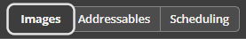

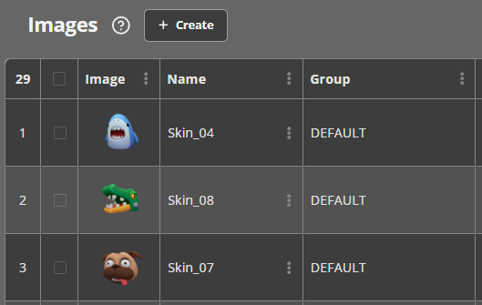

Tính năng này cho phép bạn kiểm soát thời điểm các tài nguyên trên CDN được tải về thiết bị của người dùng và khi nào chúng bị xóa.
* **Pre-Load Condition:** Một điều kiện logic để tự động bắt đầu tải trước tài nguyên khi điều kiện trở thành `TRUE`.
* **Keep Alive Condition:** Một điều kiện logic để quyết định khi nào tài nguyên bị xóa khỏi bộ nhớ cục bộ. Tài nguyên sẽ bị xóa khi điều kiện trở thành `FALSE`. Mặc định, điều kiện này trống (luôn `TRUE`), nghĩa là tài nguyên sẽ được giữ lại vĩnh viễn.

## 3. User Profiles

Profiles đóng vai trò quan trọng trong việc lưu trữ tiến trình và dữ liệu toàn diện của người chơi.

* **Best Practices:**
    * **Cấu trúc:** Khuyến nghị nên sử dụng một Profile duy nhất nhưng có cấu trúc tốt cho mỗi người dùng.
    * **Data Segmentation:** Phân loại dữ liệu một cách logic (ví dụ: `QuestsProgress`, `GeneralInfo`, `Characters`) để dễ quản lý.
    
    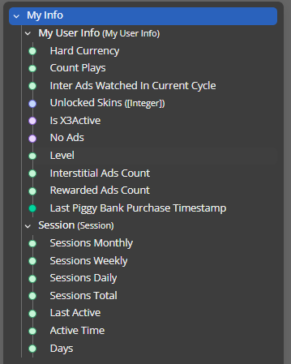

    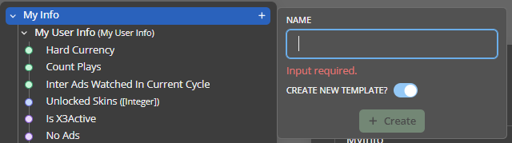

    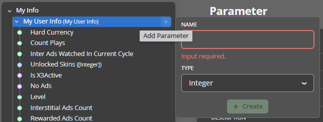
* **Technical Limits:**
    * Các kiểu dữ liệu nguyên thủy (string, int, float,...) không thể được thêm trực tiếp vào lớp đầu tiên của Profile; chỉ có thể dùng tham số loại `Data`.
    * Mỗi tham số `Data` không được vượt quá 150Kb.
* **System Profile:** Chứa các dữ liệu quan trọng do hệ thống tự thu thập để phân tích hành vi người dùng, bao gồm các mục chính như `Payments`, `SegmentsInfo`, `GeneralInfo`, và `Ads Info`.

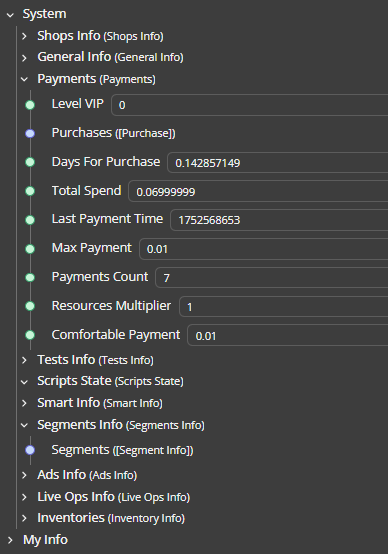

## 4. Game Items & Inventory
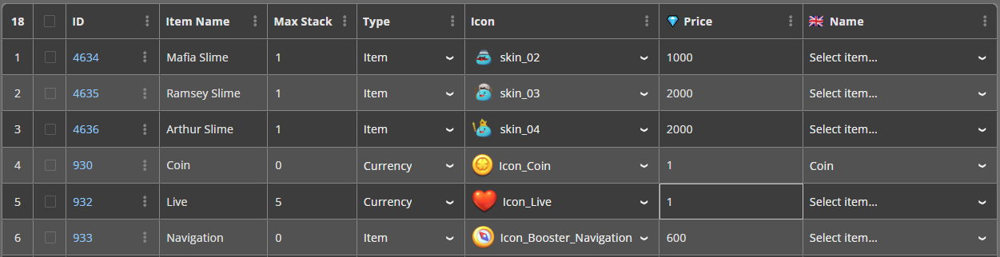
* **Game Items:** Một Item Document đại diện cho một thực thể duy nhất trong game như kiếm, khiên, gỗ, đá, v.v. Nếu cần thêm các thông số tùy chỉnh, bạn có thể tạo một Template mới kế thừa từ Template `Item` mặc định của Balancy.

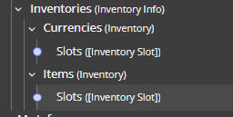

* **Inventory Management:**
    * Hệ thống Inventory của Balancy được thiết kế để lưu trữ các vật phẩm, phân thành `Currency` (tiền tệ) và `Item` (vật phẩm).
    * Balancy cung cấp sẵn hai kho đồ mặc định:
        * **Currencies Inventory:** Dùng để quản lý tiền tệ ảo (Coins, Gems).
        * **Storage Inventory:** Dùng để lưu trữ các vật phẩm thông thường (boosters, weapons).
    * Bạn có thể tương tác với kho đồ qua Visual Scripting hoặc code để thêm, xóa, hoặc kiểm tra số lượng vật phẩm.

## 5. Store & Monetization Setup

### **Hard Currency**

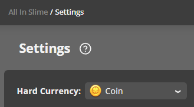

Trong mục Project Settings, bạn có thể chỉ định một Item cụ thể làm Hard Currency và thiết lập giá trị thực của nó bằng USD. Điều này rất quan trọng để Balancy tính toán giá trị các giao dịch và giúp bạn cân bằng kinh tế game. Bạn cũng có thể đặt giá trị USD cho mỗi lượt xem quảng cáo có thưởng.

### **Platforms and Products**
Đây là bước quan trọng để xác thực giao dịch mua hàng và hỗ trợ các tính năng LiveOps.
1.  **Thiết lập Platforms:** Thêm tất cả các nền tảng (ví dụ: App Store, Google Play) mà game của bạn có mặt. Đây là bước bắt buộc để xác thực giao dịch.

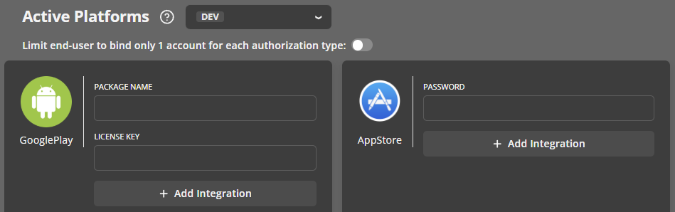

2.  **Thiết lập Products:** Khai báo thông tin về các sản phẩm trong game của bạn. Các sản phẩm này là toàn cầu (global), nhưng bạn có thể ghi đè (override) ID, tên, hoặc giá cho từng nền tảng cụ thể. Giá sản phẩm được đặt bằng USD.

### **Store Items**
Đây là các thực thể bạn bán trong cửa hàng hoặc thông qua ưu đãi.
* **Thuộc tính chính:**
    * **Sprite:** Hình ảnh đại diện cho vật phẩm.
    * **Name:** Tên của vật phẩm.
    * **Price:** Giá có thể được thiết lập dưới nhiều hình thức:
        * **Product:** Giao dịch bằng tiền thật (thông qua Hard Currency).
        * **Game Items:** Giao dịch bằng tiền tệ ảo (Soft Currency).
        * **Free:** Miễn phí.
        * **Amount of Ads watched:** Mua bằng cách xem quảng cáo.
    * **Reward:** Các vật phẩm người chơi nhận được sau khi mua.
    * **Dynamic Reward:** Một Script tùy chọn để tính toán phần thưởng một cách linh động tại thời gian chạy.

### **In-Game Store**

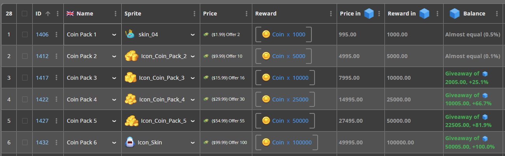

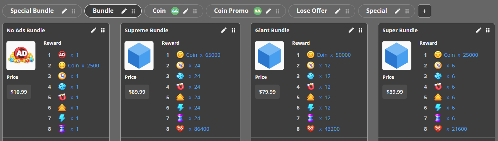

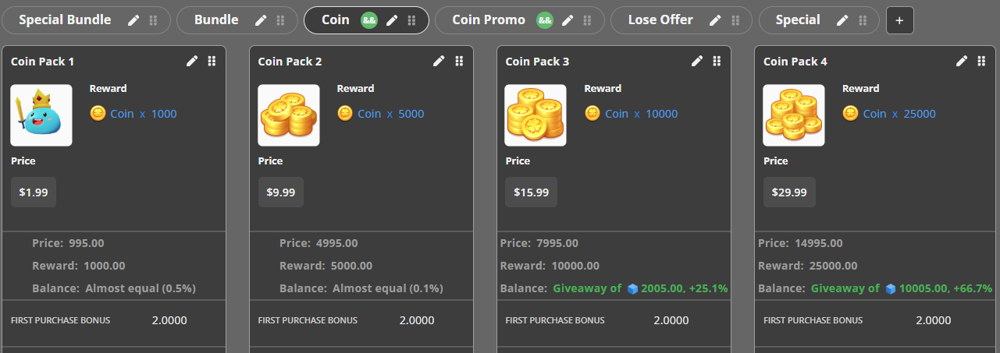

* **Thiết lập:** Bạn có thể tạo nhiều cửa hàng, mỗi cửa hàng có nhiều trang (pages) và ô (slots) trên Balancy Dashboard.
* **Sales:** Tính năng này cho phép bạn tạo các đợt giảm giá hoặc khuyến mãi (ví dụ: x3 tài nguyên với giá không đổi). Để thực hiện, bạn cần tạo một "Multiplier Script" và kích hoạt nó thông qua một Game Event.
* **Custom Store:** Đối với các game phức tạp, bạn có thể tạo một Template mới kế thừa từ `💰Game Store Base` để thêm các tham số tùy chỉnh, ví dụ như điều kiện hiển thị cửa hàng dựa trên cấp độ của người chơi.

## 6. LiveOps

LiveOps là trung tâm của việc giữ chân và tương tác với người chơi. Balancy cung cấp một bộ công cụ mạnh mẽ xoay quanh Visual Scripting, Game Events và Game Offers.

### **Visual Scripting (VS)**
Công cụ cho phép tạo logic game bằng cách kéo-thả các khối (nodes) và kết nối chúng, giúp các nhà thiết kế game có thể tạo và chỉnh sửa logic mà không cần viết code.

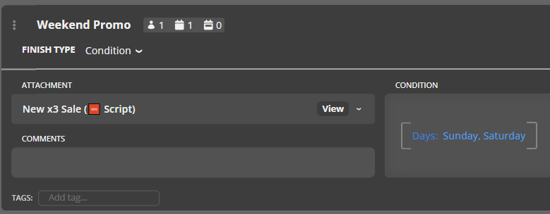

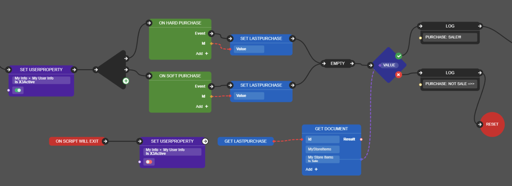

* **Core Concepts:**
    * **Nodes:** Các khối xây dựng cơ bản đại diện cho một hành động (ví dụ: kiểm tra điều kiện, thay đổi giá trị Profile).
    * **Ports:** Các điểm kết nối trên Node để truyền đi luồng thực thi (Flow) hoặc dữ liệu (Value).
    * **Links:** Các kết nối giữa các Port.
* **How to Build a Script:**
    1.  Tạo một Script mới trong mục LiveOps.
    2.  Thêm các Nodes và kết nối chúng bằng Links để định hình luồng logic.
    3.  Sử dụng **Variables** để lưu trữ giá trị tạm thời chỉ tồn tại trong Script.
* **Common Node Types:**
    * **User Profile Nodes:** `Get/Set UserProperty`, `Wait UserProperty` để tương tác với dữ liệu người chơi.
    * **Inventory Nodes:** `Add/Remove Items`, `Get Item Count` để làm việc với kho đồ.
    * **Logic Nodes:** `Branch (If)` để rẽ nhánh luồng thực thi.
    * **Execute Script Node:** Cho phép một Script này gọi một Script khác, giúp tái sử dụng logic.
* **Analytics and Best Practices:**
    * Balancy hiển thị số lượng người dùng (User Counts) đã đi qua từng nhánh trong Script, giúp bạn đánh giá hiệu quả của logic, ví dụ như tỷ lệ người chơi mua một ưu đãi.
    * **Quan trọng:** Không bao giờ sửa đổi các Script đã được triển khai và đang hoạt động. Việc này có thể phá vỡ trạng thái của những người chơi đang ở giữa chừng Script. Thay vào đó, hãy tạo một bản sao, chỉnh sửa trên bản sao đó và gán nó vào các Game Event thay cho Script cũ.

### **Game Events**

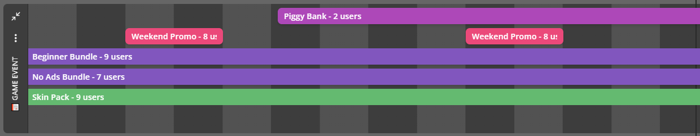

Đây là tính năng cốt lõi để lên kế hoạch và khởi chạy các hoạt động trong game như sự kiện cuối tuần, lễ hội, hoặc các giải đấu. Chúng là bước đầu tiên để kích hoạt các Game Offers.

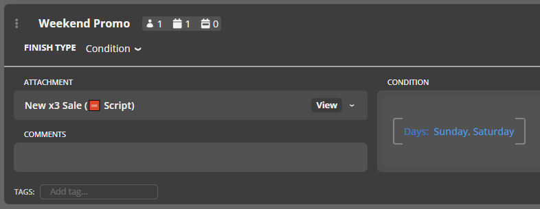

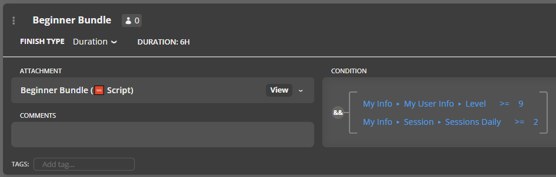

* **Cách thiết lập:**
    * Tạo một Game Event mới.
    * **Attachment:** Gắn một `Game Offer` (để kích hoạt trực tiếp) hoặc một `Script` (để chạy logic phức tạp, ví dụ như phân tập người chơi trước khi đưa ra ưu đãi).
    * **Condition:** Điều kiện để sự kiện bắt đầu. Nếu để trống, sự kiện sẽ chạy ngay khi người chơi vào game (phù hợp cho các ưu đãi như "Starter Pack").
    * **FinishType:** Xác định cách sự kiện kết thúc, có thể là khi `Condition` không còn đúng nữa, hoặc sau một khoảng thời gian (`Duration`) nhất định.

### **Game Offers (Personalised Offers)**
Game Offers giúp tối ưu hóa doanh thu và tăng giá trị cho người dùng. Chúng có thể dùng để khuyến khích người chơi mua hàng lần đầu hoặc giữ chân người chơi có nguy cơ rời đi.

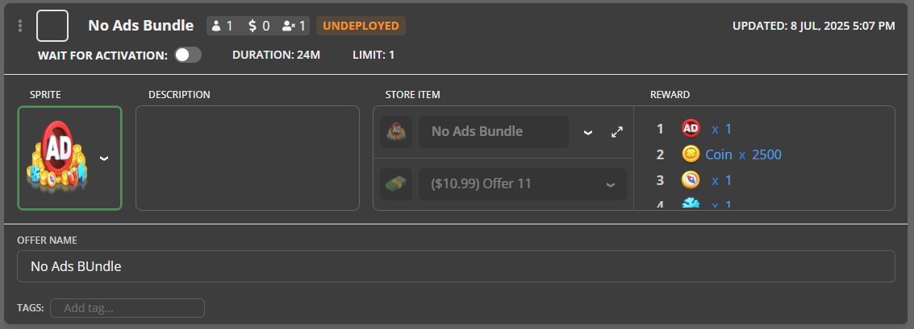

* **Thiết lập từng bước:**
    1.  **Tạo Store Items:** Cần có các vật phẩm để bán trước khi tạo ưu đãi.
    2.  **Tạo Game Offer:** Kế thừa từ Template `🎁 Game Offer` và cấu hình các thông số như Tên, Thời lượng, Store Item, Phần thưởng, Giới hạn mua, v.v.
    3.  **Kích hoạt bằng Game Events:** Tạo một Game Event để quyết định khi nào và làm thế nào Offer này được hiển thị cho người chơi.
* **Offer Groups:** Là các nhóm ưu đãi được trình bày cho người dùng.
    * **Chain Deal:** Một chuỗi các ưu đãi tuần tự, người chơi phải mua ưu đãi trước đó để thấy ưu đãi tiếp theo.
    * **Only One Purchase:** Người chơi chỉ có thể mua một vật phẩm duy nhất trong nhóm.
    * Các loại khác bao gồm `Unlimited Purchases` và `Purchase Each Offer Once`.

## 7. Deployment & Integration

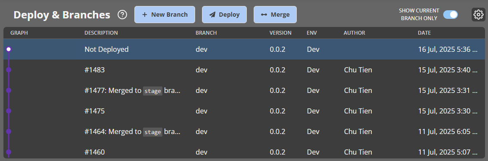

* **Deploy Changes:** Bất kỳ thay đổi nào bạn thực hiện trong Balancy, từ việc sửa một tham số cho đến tạo một Game Event mới, đều chỉ được lưu trữ nội bộ. Để chúng có hiệu lực trong game, bạn phải **Deploy** các thay đổi đó. Thao tác này tương tự như `commit/push` trong GIT.
* **Code Generation:** Balancy có thể tự động tạo mã C# để các lập trình viên truy cập vào dữ liệu game một cách dễ dàng và an toàn, giúp tăng tốc độ phát triển.
* **Integration:** Để tích hợp Balancy vào game, bạn cần có `Api Game Id` và `Public Key` từ Balancy dashboard. Để nhận các sự kiện LiveOps quan trọng (như có ưu đãi mới), lập trình viên cần triển khai một lớp kế thừa từ interface `ISmartObjectsEvents`.