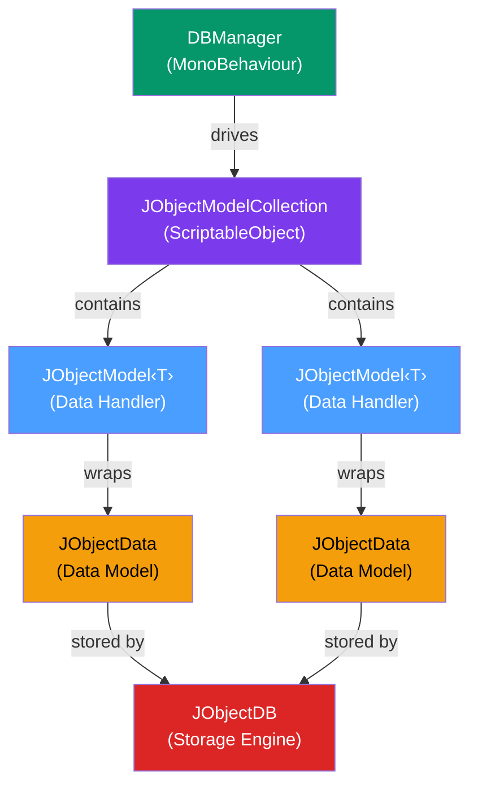
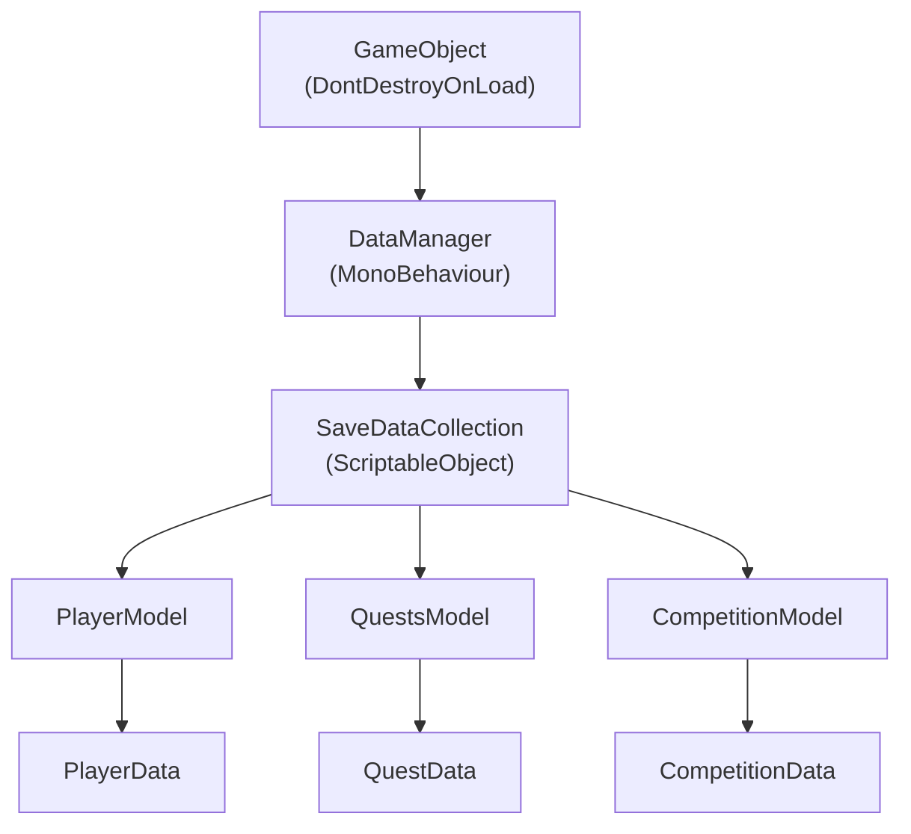
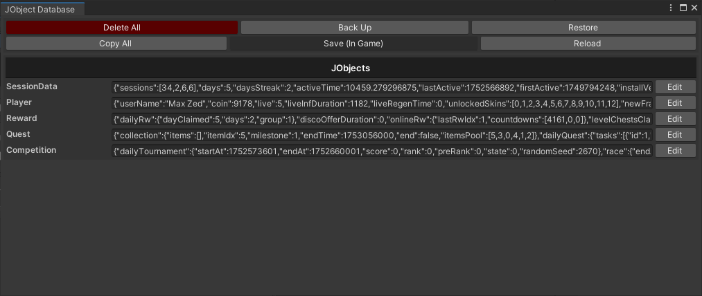
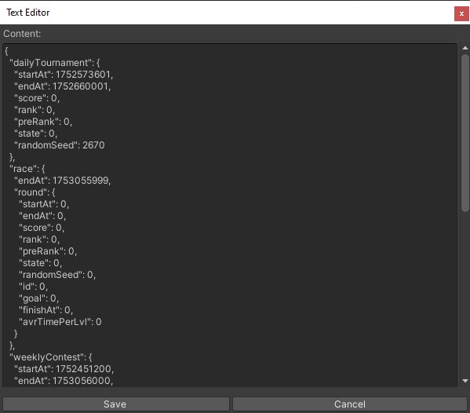
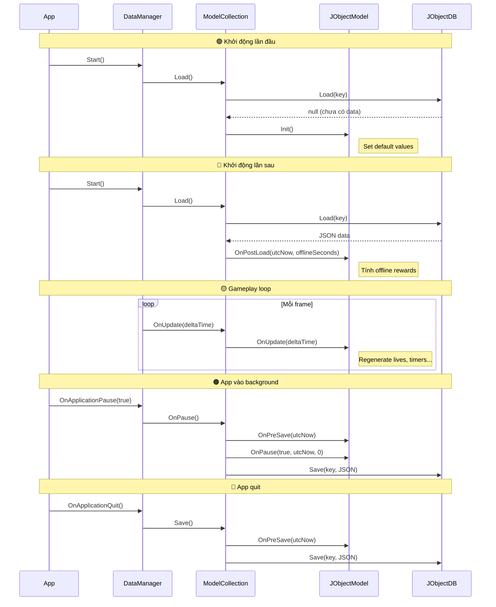

# Dynamic Player Data

## 1. Tổng Quan

**Dynamic Player Data** là dữ liệu thay đổi trong quá trình chơi — gold, level, inventory, quest progress... Sử dụng **JObjectDB** từ RCore để quản lý với auto-save, lifecycle hooks, và editor tools.

### Kiến trúc JObjectDB



| Component | Loại | Vai trò |
|---|---|---|
| **`JObjectDB`** | Static class | Storage engine — serialize JSON ↔ `PlayerPrefs`. API: Create, Load, Save, Backup, Restore |
| **`JObjectData`** | Abstract class | Base cho mọi data model. POCO serializable |
| **`JObjectModel<T>`** | ScriptableObject | Data Handler — đóng gói data + business logic + lifecycle callbacks |
| **`JObjectModelCollection`** | ScriptableObject | Aggregator — chứa mọi `JObjectModel`, điều phối Load/Save/OnUpdate |
| **`DBManager`** | MonoBehaviour | Driver trên DontDestroyOnLoad. Auto-save on pause/quit |

### Mục lục

- [2. Data Model](#2-data-model-jobjectdata)
- [3. Data Handler](#3-data-handler-jobjectmodelt): [Lifecycle Hooks](#31-lifecycle-hooks) · [Business Logic](#32-business-logic) · [Events](#33-events)
- [4. SaveDataCollection](#4-savedatacollection)
- [5. DataManager](#5-datamanager)
- [6. Editor Tools](#6-editor-tools)
- [7. Vòng Đời Data](#7-vòng-đời-data)
- [8. Troubleshooting](#8-troubleshooting)

---

## 2. Data Model (JObjectData)

Data Model là lớp POCO **chỉ chứa dữ liệu**, kế thừa `JObjectData`. Không chứa logic xử lý.

```csharp
[Serializable]
public partial class PlayerData : JObjectData
{
    public string userName;
    public int coin;
    public int live;
    public int liveInfDuration;
    public int liveRegenTime;
}
```

**Quy tắc:**

| ✅ Đúng | ❌ Sai |
|---|---|
| Chỉ chứa fields | Thêm methods (`AddCoin()`, `IsAlive()`) |
| `[Serializable]` attribute | Quên `[Serializable]` → JSON fail |
| Kế thừa `JObjectData` | Kế thừa `MonoBehaviour` |
| Kiểu serializable (int, string, List, array) | Kiểu không serializable (Dictionary, delegate) |

> **Tip:** Dùng `partial class` để chia file lớn mà không phá vỡ cấu trúc.

```csharp
// ❌ Sai: Không đặt logic trong Data Model
[Serializable]
public class PlayerData : JObjectData
{
    public int coin;
    public void AddCoin(int amount) { coin += amount; } // Logic thuộc Data Handler!
}
```

---

## 3. Data Handler (JObjectModel\<T\>)

Data Handler kế thừa `JObjectModel<T>`, chứa **logic nghiệp vụ** liên quan đến dữ liệu. Đây là "người gác cổng" đảm bảo dữ liệu luôn hợp lệ.

### 3.1. Lifecycle Hooks

```csharp
public partial class PlayerModel : JObjectModel<PlayerData>
{
    public override void Init() { }

    public override void OnPostLoad(int utcNowTimestamp, int offlineSeconds)
    {
        // Tính toán phần thưởng offline
    }

    public override void OnUpdate(float deltaTime)
    {
        // Cập nhật timer mỗi frame (ví dụ: regenerate lives)
    }

    public override void OnPause(bool pause, int utcNowTimestamp, int offlineSeconds)
    {
        // Lưu timestamp khi app vào background
    }

    public override void OnPreSave(int utcNowTimestamp)
    {
        // Validate data trước khi lưu
    }

    public override void OnRemoteConfigFetched()
    {
        // Sync khi nhận Remote Config từ server
    }
}
```

**Khi nào mỗi hook được gọi?**

| Hook | Thời điểm | Ví dụ sử dụng |
|---|---|---|
| `Init()` | Lần đầu tạo data (player mới) | Set giá trị mặc định: coin = 100, live = 5 |
| `OnPostLoad()` | Sau khi load data từ storage | Tính offline reward: "bạn rời game 3 giờ → +50 gold" |
| `OnUpdate()` | Mỗi frame (Update loop) | Đếm ngược regenerate lives, cooldown timer |
| `OnPause()` | App vào/ra background | Lưu timestamp, tạm dừng timer |
| `OnPreSave()` | Trước khi save xuống storage | Clean up temp data, validate ranges |
| `OnRemoteConfigFetched()` | Nhận Remote Config từ Firebase | Sync server-side balance changes |

### 3.2. Business Logic

Data Handler cung cấp các **phương thức an toàn** để thay đổi dữ liệu:

```csharp
public partial class PlayerModel : JObjectModel<PlayerData>
{
    // Phương thức có kiểm tra — trả về kết quả
    public bool TrySpendCoin(int amount)
    {
        if (Data.coin < amount) return false;

        Data.coin -= amount;
        OnCoinChanged?.Invoke(Data.coin);
        MarkDirty();  // Đánh dấu cần lưu
        return true;
    }

    // Phương thức đơn giản
    public void AddCoin(int amount)
    {
        Data.coin += amount;
        OnCoinChanged?.Invoke(Data.coin);
        MarkDirty();
    }
}
```

**Pattern quan trọng:**
- **`MarkDirty()`** — Đánh dấu data đã thay đổi → hệ thống sẽ auto-save khi cần
- **Validation trước khi thay đổi** — `TrySpend` pattern: kiểm tra → thay đổi → thông báo
- **Không expose Data trực tiếp** — Luôn đi qua methods của Handler

### 3.3. Events

Data Handler phát **events** khi data thay đổi → các phần khác lắng nghe và tự cập nhật:

```csharp
public partial class PlayerModel : JObjectModel<PlayerData>
{
    // Khai báo events
    public event Action<int> OnCoinChanged;
    public event Action<int> OnLevelUp;
    public event Action<string> OnItemAdded;
}
```

```csharp
// Lắng nghe từ bất kỳ đâu
playerModel.OnCoinChanged += (newAmount) => {
    hudView.UpdateCoinText(newAmount);
};

playerModel.OnLevelUp += (newLevel) => {
    achievementSystem.CheckLevelAchievements(newLevel);
};
```

> **Sức mạnh của pattern này:** ShopPresenter không biết HUD tồn tại. HUDPresenter tự lắng nghe event và tự cập nhật. Các module hoàn toàn độc lập.

### 3.4. Giao tiếp giữa các Models

Khi một Model cần truy cập dữ liệu từ Model khác (ví dụ: `PlayerModel` cần kiểm tra `CompetitionModel`), sử dụng **`[SerializeField]` reference** — được gán tự động qua Inspector hoặc attribute `[AutoFill]`:

```csharp
public partial class PlayerModel : JObjectModel<PlayerData>
{
    // Reference đến model khác — gán qua Inspector hoặc [AutoFill]
    [AutoFill, SerializeField] private CompetitionModel m_competitionModel;

    public bool CanJoinRace()
    {
        // Truy cập cross-model an toàn
        return Data.CurrentLevel >= m_competitionModel.RaceUnlockLevel;
    }
}
```

> **Quy tắc:**
> - Sử dụng `[SerializeField]` + `[AutoFill]` để reference — **không** dùng singleton hoặc static reference
> - Chỉ **đọc** dữ liệu từ model khác — **không sửa** dữ liệu của model khác
> - Nếu cần thay đổi dữ liệu model khác → giao tiếp qua Events (§3.3)

---

## 4. SaveDataCollection

`SaveDataCollection` kế thừa `JObjectModelCollection` để quản lý **tất cả Data Handlers** trong game:

```csharp
public class SaveDataCollection : JObjectModelCollection
{
    [CreateScriptableObject] public PlayerModel player;
    [CreateScriptableObject] public QuestsModel quest;
    [CreateScriptableObject] public CompetitionModel competition;

    public override void Load() { }
    public override void PostLoad() { }
}
```

> `[CreateScriptableObject]` là attribute từ RCore — tự thêm nút "Create" trong Inspector để tạo ScriptableObject nhanh.


**Vai trò:**
- Tập hợp mọi `JObjectModel` tại một điểm trung tâm
- Điều phối `Load()`, `Save()`, `OnUpdate()` cho tất cả models
- Dễ dàng thêm model mới: thêm 1 dòng field + nhấn Create

---

## 5. DataManager

`DataManager` kế thừa `DBManager`, đặt trên **DontDestroyOnLoad** GameObject. Đây là component điều phối auto-save, auto-load cho toàn bộ hệ thống:

```csharp
public class DataManager : DBManager
{
    private static DataManager m_Instance;
    public static DataManager Instance
    {
        get
        {
            if (m_Instance == null)
                m_Instance = FindObjectOfType<DataManager>();
            return m_Instance;
        }
    }
}
```

**Chức năng tự động:**
- **Auto-save** khi app pause (vào background) và quit
- **Auto-load** khi khởi động game
- Điều phối **OnUpdate** mỗi frame cho tất cả JObjectModels
- Configurable save delay (tránh save quá thường xuyên)

### Kết nối các thành phần



---

## 6. Editor Tools

RCore cung cấp Editor Tools giúp debug và chỉnh sửa dữ liệu trong quá trình phát triển.

### 7.1. JObjectDB Editor

Công cụ xem và chỉnh sửa dữ liệu người chơi dưới dạng JSON ngay trong Unity Editor.

**Truy cập:** `RCore > JObject Database > JObjectDB Editor`


**Chức năng chính:**
- Hiển thị toàn bộ dữ liệu (`Player`, `Quest`, `SessionData`...) dưới dạng JSON
- Chỉnh sửa trực tiếp từng mục qua cửa sổ "Text Editor"
- **Delete All** — Xóa toàn bộ data để test fresh
- **Back Up** — Sao lưu data hiện tại
- **Restore** — Khôi phục từ bản sao lưu





### 7.2. ScriptableObject Inspector

Mỗi `JObjectModel` hiển thị dữ liệu trực tiếp trong Inspector, hỗ trợ chỉnh sửa nhanh:


> Kết hợp cả hai công cụ: **JObjectDB Editor** cho view tổng quan JSON, **SO Inspector** cho chỉnh sửa nhanh từng field.

---

## 7. Vòng Đời Data

Sơ đồ dưới đây minh họa vòng đời hoàn chỉnh của player data:



---

## 8. Troubleshooting

| Vấn đề | Nguyên nhân | Giải pháp |
|---|---|---|
| Data không lưu khi quit | `DataManager` không trên DontDestroyOnLoad | Đặt DataManager trên GameObject persist |
| Data bị reset khi cập nhật app | PlayerPrefs bị xóa (uninstall/reinstall) | Implement cloud save backup |
| `Init()` không được gọi | Data đã tồn tại từ lần chơi trước | `Init()` chỉ gọi lần đầu. Dùng `OnPostLoad()` cho logic sau mỗi lần load |
| `OnUpdate()` không chạy | Model chưa được thêm vào `SaveDataCollection` | Khai báo field trong `SaveDataCollection` và tạo ScriptableObject |
| Data lớn gây lag khi save | JSON serialize object phức tạp | Tách data thành nhiều model nhỏ, dùng `MarkDirty()` để chỉ save khi thay đổi |
| PlayerPrefs đầy (~1MB limit) | Quá nhiều data lưu trong PlayerPrefs | Cân nhắc migrate sang file-based storage |
| Conflict khi nhiều model cùng sửa data | Thiếu single source of truth | Mỗi data field chỉ thuộc 1 model duy nhất, giao tiếp qua events |
| Migration data khi thêm field mới | JSON cũ không có field → giá trị mặc định (0, null) | Xử lý migration trong `OnPostLoad()`: kiểm tra và set default cho field mới |
