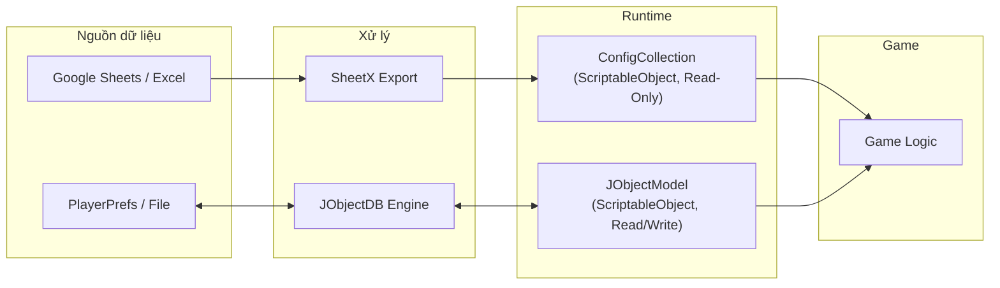
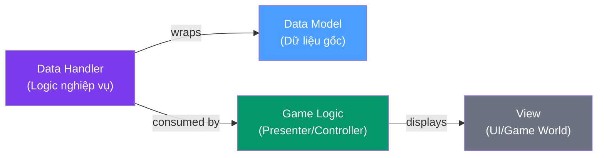
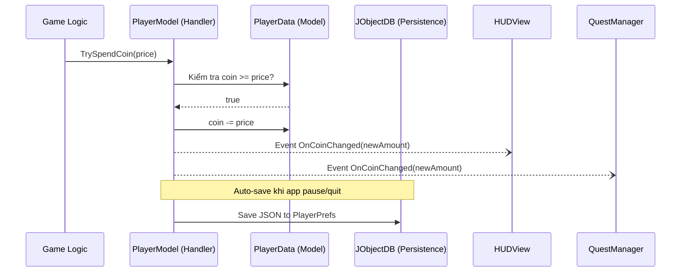

# Quản Lý Data Trong Unity Game

## Giới thiệu

Tài liệu này hướng dẫn cách thiết kế và xây dựng **hệ thống quản lý data** trong dự án Unity, sử dụng framework **RCore** và công cụ **SheetX**. Kiến trúc này là kết quả tiến hóa qua 3 giai đoạn: từ Spaghetti PlayerPrefs rải khắp nơi → God Class SaveManager 3000 dòng → Layered System tách Data, Logic, Persistence theo domain.

### Vấn đề cần giải quyết

Trong phát triển game, data là nền tảng của mọi thứ — từ chỉ số nhân vật, giá vật phẩm, đến nội dung bản địa hóa. Nếu không có hệ thống quản lý data tốt:

| Vấn đề | Hậu quả |
|---|---|
| **Designer phụ thuộc Developer** | Mỗi khi muốn thay đổi một con số, Designer phải nhờ Dev sửa code → tạo bottleneck |
| **Dữ liệu người chơi không ổn định** | Save data dễ bị lỗi, mất mát, hoặc không migrate được khi cập nhật |
| **Code kết dính** | Logic game, dữ liệu và giao diện trộn lẫn → khó debug, khó test, khó mở rộng |

### Giải pháp

Sử dụng **hai hệ thống data riêng biệt**, mỗi hệ thống phục vụ một mục đích khác nhau:

| Loại Data | Công cụ | Đặc điểm | Ví dụ |
|---|---|---|---|
| **Static Config Data** | SheetX + `ConfigCollection` | Chỉ đọc, do Designer quản lý qua Sheets | Chỉ số Hero, giá vật phẩm, level design |
| **Dynamic Player Data** | JObjectDB + `JObjectModel<T>` | Đọc/ghi, lưu tiến trình người chơi | Gold, level, inventory, quest progress |

### Tài liệu chi tiết

| Tài liệu | Nội dung |
|---|---|
| [**Static Config Data**](static_config_data) | **Config Pipeline** — Thiết kế bảng dữ liệu, SheetX export, ConfigCollection, Localization |
| [**Dynamic Player Data**](dynamic_player_data) | **Data Gateway, Lifecycle, Observer** — JObjectDB, Data Model, Data Handler, Events, Editor Tools |

---

## Kiến Trúc Data

Kiến trúc data được xây dựng theo mô hình **phân lớp**, áp dụng nguyên tắc tách biệt giữa **dữ liệu thuần túy** và **logic xử lý dữ liệu**.

### Sơ đồ tổng quan



### Các lớp data

Trong kiến trúc game, data được tổ chức thành các lớp với trách nhiệm riêng biệt:

| Lớp | Vai trò | Class trong RCore | Loại |
|---|---|---|---|
| **Data Model** | Chứa dữ liệu thuần túy, không có logic | `JObjectData` | POCO (`[Serializable]`) |
| **Data Handler** | Đóng gói Data Model + logic nghiệp vụ | `JObjectModel<T>` | `ScriptableObject` |
| **Data Collection** | Tập hợp và điều phối tất cả Data Handlers | `JObjectModelCollection` | `ScriptableObject` |
| **Data Manager** | Kết nối Unity lifecycle, auto-save/load | `DBManager` | `MonoBehaviour` |

### Nguyên tắc cốt lõi



| Nguyên tắc | Mô tả | Vi phạm phổ biến |
|---|---|---|
| **Data Model không chứa logic** | Chỉ là container dữ liệu thuần túy | Thêm method `AddGold()` vào Data Model |
| **Data Handler kiểm soát mọi thay đổi** | Luôn thay đổi data qua Handler, không sửa trực tiếp | Code bên ngoài viết `data.coin -= 100` |
| **Giao tiếp qua Events** | Handler phát event khi data thay đổi | Handler gọi trực tiếp `view.UpdateText()` |

### Luồng hoạt động mẫu: Mua vật phẩm

Ví dụ minh họa cách các lớp data phối hợp khi người chơi mua vật phẩm:



**Điểm then chốt:**
- Game Logic **không trực tiếp sửa** `PlayerData.coin` — luôn đi qua `PlayerModel.TrySpendCoin()`
- `PlayerModel` phát event `OnCoinChanged` → bất kỳ ai subscribe đều tự cập nhật (HUD, Quest, Shop...)
- Persistence xảy ra **tự động** — không cần gọi Save thủ công

### Ưu điểm

| # | Ưu điểm | Tác động |
|---|---|---|
| 1 | **Designer Independence** — Config data sửa trên Sheets, không cần Dev | Tăng tốc iteration 3-5x |
| 2 | **Unity-Native** — ScriptableObject, Inspector-friendly, asset-based | Zero friction với Unity workflow |
| 3 | **Auto Lifecycle** — Init/OnUpdate/OnPause/OnPreSave tự động | Không quên save, không quên offline calculation |
| 4 | **Editor Tooling** — View/edit JSON data trực tiếp trong Editor | Debug speed tăng đáng kể |
| 5 | **Modular** — Thêm feature mới = thêm Data + Model + 1 dòng trong Collection | Scale nhanh theo feature |
| 6 | **Type-Safe** — SheetX generate C# IDs/Constants | Compile-time error thay vì runtime crash |
| 7 | **Decoupled** — Events pattern, các module không biết nhau tồn tại | Dễ maintain, dễ test |

### Anti-Patterns phổ biến

#### 1. Fat Data Model — "God Object"

Gom tất cả fields vào 1 file `PlayerData.cs` 500+ dòng — 2 devs cùng sửa là merge conflict.

```csharp
// ❌ Sai: 1 file chứa mọi thứ
public class PlayerData : JObjectData
{
    public int coins, level, lives;
    public List<int> unlockedAvatars;
    public List<Booster> boosters;
    public int questProgress, raceRank;
    // ... 50+ fields
}

// ✅ Đúng: partial class chia theo domain
// PlayerData.cs — core
public partial class PlayerData : JObjectData
{  public int coins, level, lives; }

// PlayerData.Inventory.cs
public partial class PlayerData
{  public List<Booster> boosters; }

// PlayerData.Avatar.cs
public partial class PlayerData
{  public List<int> unlockedAvatars; }
```

> Khi một domain phức tạp đến mức partial class không đủ (ví dụ: inventory có logic riêng, quest có lifecycle riêng), hãy tách thành **model riêng** (`InventoryModel`, `QuestModel`) thay vì tiếp tục nhét vào `PlayerData`.

#### 2. Config data bị mutate runtime

Sửa trực tiếp config từ SheetX để buff chỉ số — config sẽ sai vĩnh viễn trong session đó.

```csharp
// ❌ Sai: sửa thẳng config (Read-Only!)
var hero = DataConfigCollection.Instance.GetHero(heroId);
hero.attack += buffValue;
hero.maxHp += 200;

// ✅ Đúng: tách runtime modifier riêng
var baseAtk = DataConfigCollection.Instance.GetHero(heroId).attack;
int finalAtk = baseAtk + GetBuffTotal();
```

#### 3. Cross-model mutation — bypass Data Gateway

Model khác chọc thẳng vào `.data` để sửa, bỏ qua validation và event của Handler.

```csharp
// ❌ Sai: StoreModel sửa trực tiếp data của PlayerModel
var player = SaveDataCollection.Instance.player;
player.data.coins -= item.price;
player.data.purchasedIapIds.Add(item.id);

// ✅ Đúng: gọi qua Handler methods
player.AddCurrency(IDs.Currency.c_Coin, -price, groupPlacement, placement);
```

#### 4. Data Handler xử lý UI / Audio

Handler nhét presentation logic (update text, play sound, play VFX) — dính chặt vào View, không test được.

```csharp
// ❌ Sai: Handler làm việc của View
public void AddCurrency(int amount) {
    Data.coin += amount;
    coinText.text = Data.coin.ToString();  // UI
    AudioManager.Play("coin_collect");     // Audio
    coinVfx.Play();                        // VFX
}

// ✅ Đúng: Handler chỉ phát event
public void AddCurrency(int amount) {
    Data.coin += amount;
    OnCoinChanged?.Invoke(Data.coin);
}
// HUDView subscribe → cập nhật text + VFX
// AudioView subscribe → play sound
```

### Phù hợp cho

| Loại game | Phù hợp? | Ghi chú |
|---|---|---|
| Mobile Casual / Mid-core | ✅ Rất phù hợp | Sweet spot của kiến trúc này |
| Prototype / Game Jam | ✅ Tốt | Setup nhanh, có sẵn lifecycle + tools |
| Mobile Hardcore RPG | ⚠️ Cần bổ sung | Thêm cloud save, anti-cheat, data versioning |
| Multiplayer Online | ⚠️ Thiếu | Không có server-authoritative data |
| PC/Console AAA | ❌ Không phù hợp | Cần file-based + async I/O |

---

## SheetX

**SheetX** là công cụ chuyển đổi dữ liệu từ **Google Sheets** hoặc **Excel** thành tệp sẵn sàng sử dụng trong Unity — bao gồm C# scripts (IDs, Constants, Localization API) và JSON data. Designer sửa Sheets → nhấn Export → code tự cập nhật, không cần Developer can thiệp.

| Khả năng | Mô tả |
|---|---|
| **IDs & Constants** | Auto-generate C# enums và hằng số từ sheet, type-safe, compile-time checked |
| **JSON Data** | Export bảng dữ liệu thành JSON, hỗ trợ mảng, JSON object, attribute system cho RPG |
| **Localization** | Đa ngôn ngữ, hỗ trợ dynamic text, CJK character set cho TextMeshPro |
| **Google Sheets** | Kết nối trực tiếp Google Sheets qua API, download và export trong Unity Editor |

SheetX có 2 phiên bản:

| Phiên bản | Mô tả | Link |
|---|---|---|
| **Unity Editor** | Tích hợp trực tiếp trong Unity, export từ menu `RCore > SheetX` | [SheetX](https://hnb-rabear.github.io/sheetx) |
| **Winform** | Ứng dụng Windows độc lập, xử lý data ngoài Unity Editor | [excel-to-unity](https://github.com/hnb-rabear/excel-to-unity) |

> Chi tiết cách thiết kế sheet, quy tắc đặt tên, và export workflow xem tại [Static Config Data](static_config_data).

---

## Cài Đặt

### Yêu cầu

Cài đặt các thư viện sau qua **Unity Package Manager** → *"Add package from git URL..."*:

| Thứ tự | Thư viện | Git URL |
|:---:|---|---|
| 1 | **UniTask** | `https://github.com/Cysharp/UniTask.git?path=src/UniTask/Assets/Plugins/UniTask` |
| 2 | **RCore** | `https://github.com/hnb-rabear/RCore.git?path=Assets/RCore/Main` |
| 3 | **SheetX** | `https://github.com/hnb-rabear/RCore.git?path=Assets/RCore.SheetX` |

> **Lưu ý:** UniTask là dependency bắt buộc — cần cài trước RCore.

### Thiết lập thư mục xuất dữ liệu

Tạo các thư mục sau trong dự án Unity:

```
Assets/
├── Scripts/Generated/     ← Script C# (IDs, Constants, Localization API)
├── DataConfig/            ← Tệp dữ liệu JSON
└── Resources/
    └── Localizations/     ← Dữ liệu bản địa hóa
```

Cấu hình trong `RCore > SheetX > Settings`:

| Trường | Giá trị |
|---|---|
| **Scripts Output Folder** | `Assets/Scripts/Generated` |
| **JSON Output Folder** | `Assets/DataConfig` |
| **Localization Output** | `Assets/Resources/Localizations` |

> Nếu sử dụng **Addressable Assets**, đặt thư mục Localization bên ngoài `Resources` và đánh dấu là Addressable Asset.

### Cấu hình Google Sheets (tùy chọn)

1. Lấy **Google Client ID** và **Client Secret** từ Google Console ([Hướng dẫn](https://hnb-rabear.github.io/sheetx/how-get-google-client-id-and-secret-id)).
2. Dán vào các trường tương ứng trong `RCore > SheetX > Settings`.
3. Thêm ID Google Sheet vào `RCore > SheetX > Google Spreadsheets`.

---

## Dự Án Mẫu

**LiveOps Template** là dự án mẫu hoàn chỉnh tích hợp RCore và SheetX, minh họa cách xây dựng hệ thống data cho các tính năng LiveOps phổ biến:

🔗 **Repository:** https://gitlab.ikameglobal.com/hungnb/liveopstemplate.git

| Nhóm | Tính năng |
|---|---|
| **Store** | Store, Special Offers, Piggy Bank |
| **Reward** | Daily Bonus, Star Chest, Level Chest, Free Reward |
| **Quest** | Daily Quest, Rocket Rush, Collection, Pinata |
| **Competition** | Race, Volcano Quest, Global Leaderboard, Weekly Contest |

> Mỗi feature trong template được xây dựng theo kiến trúc phân lớp data đã trình bày ở trên, có thể tham khảo trực tiếp source code làm ví dụ thực tế.

---

## Tổng Kết

| Bước | Nội dung | Tài liệu |
|:---:|---|---|
| 1 | Cài đặt RCore + SheetX + UniTask | Trang này |
| 2 | Thiết kế Sheets → Export → ConfigCollection | [Static Config Data](static_config_data) |
| 3 | Tạo `JObjectData` → `JObjectModel<T>` → `DBManager` | [Dynamic Player Data](dynamic_player_data) |

> Toàn bộ hệ thống Data Management này là nền tảng cho kiến trúc **MVP (Model-View-Presenter)** — View và Presenter không sửa data trực tiếp, luôn đi qua Data Handler.
