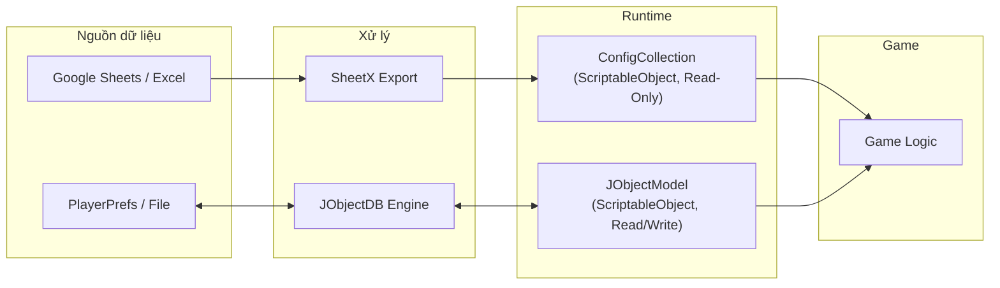
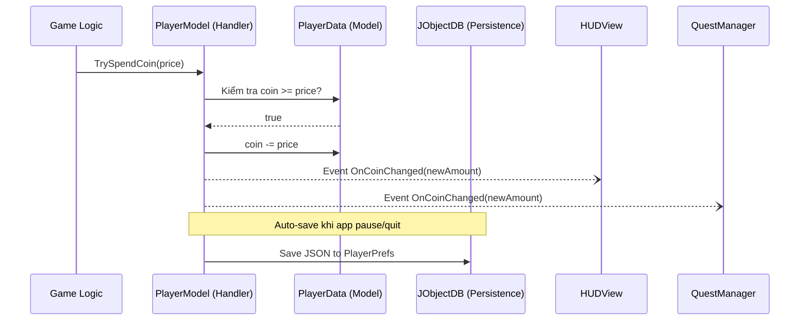

# Quản Lý Data Trong Unity Game

## Giới thiệu

Tài liệu này hướng dẫn cách thiết kế **hệ thống quản lý data** trong dự án Unity, sử dụng framework **RCore** và công cụ **SheetX**.

Nếu không có hệ thống quản lý data tốt, Designer phụ thuộc Dev cho mọi thay đổi số liệu, save data dễ lỗi khi cập nhật, và code logic/data/UI trộn lẫn khó mở rộng.

**Giải pháp:** tách thành hai hệ thống data riêng biệt:

| Loại Data | Công cụ | Đặc điểm | Ví dụ |
|---|---|---|---|
| **Static Config Data** | SheetX + `ConfigCollection` | Chỉ đọc, Designer quản lý qua Sheets | Chỉ số Hero, giá vật phẩm |
| **Dynamic Player Data** | JObjectDB + `JObjectModel<T>` | Đọc/ghi, lưu tiến trình người chơi | Gold, inventory, quest progress |

**Tài liệu chi tiết:** [Static Config Data](static_config_data) | [Dynamic Player Data](dynamic_player_data)

---

## Kiến Trúc Data



### Các lớp data

| Lớp | Vai trò | Class trong RCore | Loại |
|---|---|---|---|
| **Data Model** | Dữ liệu thuần túy, không có logic | `JObjectData` | POCO (`[Serializable]`) |
| **Data Handler** | Đóng gói Data Model + logic nghiệp vụ | `JObjectModel<T>` | `ScriptableObject` |
| **Data Collection** | Tập hợp và điều phối tất cả Handlers | `JObjectModelCollection` | `ScriptableObject` |
| **Data Manager** | Kết nối Unity lifecycle, auto-save/load | `DBManager` | `MonoBehaviour` |

### Nguyên tắc cốt lõi

| Nguyên tắc | Mô tả | Vi phạm phổ biến |
|---|---|---|
| **Data Model không chứa logic** | Chỉ là container dữ liệu thuần túy | Thêm method `AddGold()` vào Data Model |
| **Thay đổi data qua Handler** | Luôn đi qua Handler, không sửa trực tiếp | Code bên ngoài viết `data.coin -= 100` |
| **Giao tiếp qua Events** | Handler phát event khi data thay đổi | Handler gọi trực tiếp `view.UpdateText()` |

### Luồng hoạt động mẫu: Mua vật phẩm



### Ưu điểm

| Ưu điểm | Tác động |
|---|---|
| **Designer Independence** — Config sửa trên Sheets, không cần Dev | Tăng tốc iteration 3-5x |
| **Auto Lifecycle** — Init/OnUpdate/OnPause/OnPreSave tự động | Không quên save, không quên offline calculation |
| **Modular** — Thêm feature = thêm Data + Model + 1 dòng trong Collection | Scale nhanh theo feature |
| **Decoupled** — Events pattern, các module không biết nhau | Dễ maintain, dễ test |

Phù hợp nhất cho **mobile casual / mid-core**. Với hardcore RPG cần bổ sung cloud save, anti-cheat. Không phù hợp cho multiplayer online hoặc PC/Console AAA.

---

## Anti-Patterns

### 1. Fat Data Model — "God Object"

Gom tất cả fields vào 1 file 500+ dòng — merge conflict liên tục.

```csharp
// ❌ Sai: 1 file chứa mọi thứ
public class PlayerData : JObjectData
{
    public int coins, level, lives;
    public List<int> unlockedAvatars;
    public List<Booster> boosters;
    public int questProgress, raceRank;
    // ... 50+ fields
}

// ✅ Đúng: partial class chia theo domain
// PlayerData.cs — core
public partial class PlayerData : JObjectData
{  public int coins, level, lives; }

// PlayerData.Inventory.cs
public partial class PlayerData
{  public List<Booster> boosters; }

// PlayerData.Avatar.cs
public partial class PlayerData
{  public List<int> unlockedAvatars; }
```

> Khi domain phức tạp hơn, tách thành **model riêng** (`InventoryModel`, `QuestModel`).

### 2. Config data bị mutate runtime

Sửa trực tiếp config từ SheetX — config sẽ sai vĩnh viễn trong session đó.

```csharp
// ❌ Sai: sửa thẳng config (Read-Only!)
var hero = DataConfigCollection.Instance.GetHero(heroId);
hero.attack += buffValue;

// ✅ Đúng: tách runtime modifier riêng
var baseAtk = DataConfigCollection.Instance.GetHero(heroId).attack;
int finalAtk = baseAtk + GetBuffTotal();
```

### 3. Cross-model mutation — bypass Data Gateway

Model khác chọc thẳng vào `.data`, bỏ qua validation và event của Handler.

```csharp
// ❌ Sai: StoreModel sửa trực tiếp data của PlayerModel
var player = SaveDataCollection.Instance.player;
player.data.coins -= item.price;

// ✅ Đúng: gọi qua Handler methods
player.AddCurrency(IDs.Currency.c_Coin, -price, groupPlacement, placement);
```

### 4. Data Handler xử lý UI / Audio

Handler nhét presentation logic — dính chặt vào View, không test được.

```csharp
// ❌ Sai: Handler làm việc của View
public void AddCurrency(int amount) {
    Data.coin += amount;
    coinText.text = Data.coin.ToString();  // UI
    AudioManager.Play("coin_collect");     // Audio
}

// ✅ Đúng: Handler chỉ phát event
public void AddCurrency(int amount) {
    Data.coin += amount;
    OnCoinChanged?.Invoke(Data.coin);
}
// HUDView subscribe → cập nhật text + VFX
// AudioView subscribe → play sound
```

---

## SheetX

**SheetX** chuyển đổi dữ liệu từ **Google Sheets / Excel** thành C# scripts và JSON data cho Unity. Designer sửa Sheets → nhấn Export → code tự cập nhật.

| Khả năng | Mô tả |
|---|---|
| **IDs & Constants** | Auto-generate C# enums và hằng số, type-safe, compile-time checked |
| **JSON Data** | Export bảng dữ liệu thành JSON, hỗ trợ mảng, JSON object, attribute system |
| **Localization** | Đa ngôn ngữ, dynamic text, CJK character set cho TextMeshPro |
| **Google Sheets** | Kết nối trực tiếp qua API, download và export trong Unity Editor |

| Phiên bản | Mô tả | Link |
|---|---|---|
| **Unity Editor** | Tích hợp trong Unity, export từ menu `RCore > SheetX` | [SheetX](https://hnb-rabear.github.io/sheetx) |
| **Winform** | Ứng dụng Windows độc lập, xử lý data ngoài Unity Editor | [excel-to-unity](https://github.com/hnb-rabear/excel-to-unity) |

> Chi tiết thiết kế sheet, quy tắc đặt tên, và export workflow xem tại [Static Config Data](static_config_data).

---

## Cài Đặt

Cài đặt qua **Unity Package Manager** → *"Add package from git URL..."*:

| Thứ tự | Thư viện | Git URL |
|:---:|---|---|
| 1 | **UniTask** | `https://github.com/Cysharp/UniTask.git?path=src/UniTask/Assets/Plugins/UniTask` |
| 2 | **RCore** | `https://github.com/hnb-rabear/RCore.git?path=Assets/RCore/Main` |
| 3 | **SheetX** | `https://github.com/hnb-rabear/RCore.git?path=Assets/RCore.SheetX` |

> **Lưu ý:** UniTask là dependency bắt buộc — cần cài trước RCore.

### Thiết lập thư mục xuất dữ liệu

```
Assets/
├── Scripts/Generated/     ← Script C# (IDs, Constants, Localization API)
├── DataConfig/            ← Tệp dữ liệu JSON
└── Resources/
    └── Localizations/     ← Dữ liệu bản địa hóa
```

Cấu hình trong `RCore > SheetX > Settings`:

| Trường | Giá trị |
|---|---|
| **Scripts Output Folder** | `Assets/Scripts/Generated` |
| **JSON Output Folder** | `Assets/DataConfig` |
| **Localization Output** | `Assets/Resources/Localizations` |

> Nếu sử dụng **Addressable Assets**, đặt thư mục Localization bên ngoài `Resources` và đánh dấu là Addressable Asset.

### Cấu hình Google Sheets (tùy chọn)

1. Lấy **Google Client ID** và **Client Secret** từ Google Console ([Hướng dẫn](https://hnb-rabear.github.io/sheetx/how-get-google-client-id-and-secret-id)).
2. Dán vào `RCore > SheetX > Settings`.
3. Thêm ID Google Sheet vào `RCore > SheetX > Google Spreadsheets`.

---

## Dự Án Mẫu

**LiveOps Template** — dự án mẫu tích hợp RCore và SheetX:

🔗 **Repository:** https://gitlab.ikameglobal.com/hungnb/liveopstemplate.git

| Nhóm | Tính năng |
|---|---|
| **Store** | Store, Special Offers, Piggy Bank |
| **Reward** | Daily Bonus, Star Chest, Level Chest, Free Reward |
| **Quest** | Daily Quest, Rocket Rush, Collection, Pinata |
| **Competition** | Race, Volcano Quest, Global Leaderboard, Weekly Contest |

> Toàn bộ hệ thống này là nền tảng cho kiến trúc **MVP (Model-View-Presenter)** — View và Presenter luôn đi qua Data Handler, không sửa data trực tiếp.
