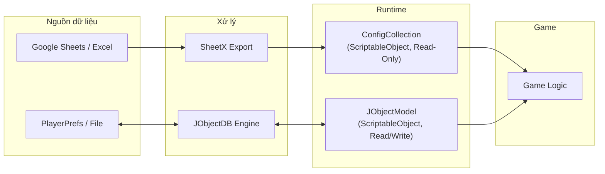
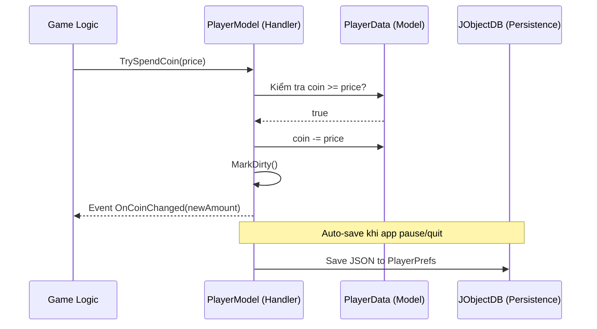

# Quản Lý Data Trong Unity Game

## Giới thiệu

Tài liệu này hướng dẫn cách thiết kế và xây dựng **hệ thống quản lý data** trong dự án Unity, sử dụng framework **RCore** và công cụ **SheetX**.

### Vấn đề cần giải quyết

Trong phát triển game, data là nền tảng của mọi thứ — từ chỉ số nhân vật, giá vật phẩm, đến nội dung bản địa hóa. Nếu không có hệ thống quản lý data tốt:

| Vấn đề | Hậu quả |
|---|---|
| **Designer phụ thuộc Developer** | Mỗi khi muốn thay đổi một con số, Designer phải nhờ Dev sửa code → tạo bottleneck |
| **Dữ liệu người chơi không ổn định** | Save data dễ bị lỗi, mất mát, hoặc không migrate được khi cập nhật |
| **Code kết dính** | Logic game, dữ liệu và giao diện trộn lẫn → khó debug, khó test, khó mở rộng |

### Giải pháp

Sử dụng **hai hệ thống data riêng biệt**, mỗi hệ thống phục vụ một mục đích khác nhau:

| Loại Data | Công cụ | Đặc điểm | Ví dụ |
|---|---|---|---|
| **Static Config Data** | SheetX + `ConfigCollection` | Chỉ đọc, do Designer quản lý qua Sheets | Chỉ số Hero, giá vật phẩm, level design |
| **Dynamic Player Data** | JObjectDB + `JObjectModel` | Đọc/ghi, lưu tiến trình người chơi | Gold, level, inventory, quest progress |

### Tài liệu chi tiết

| Tài liệu | Nội dung |
|---|---|
| [**Static Config Data**](static_config_data) | Thiết kế bảng dữ liệu, SheetX export, ConfigCollection, Localization |
| [**Dynamic Player Data**](dynamic_player_data) | JObjectDB, Data Model, Data Handler, Editor Tools |

---

## Kiến Trúc Data

Kiến trúc data được xây dựng theo mô hình **phân lớp**, áp dụng nguyên tắc tách biệt giữa **dữ liệu thuần túy** và **logic xử lý dữ liệu**.

### Sơ đồ tổng quan



### Các lớp data

Trong kiến trúc game, data được tổ chức thành các lớp với trách nhiệm riêng biệt:

| Lớp | Vai trò | Class trong RCore | Loại |
|---|---|---|---|
| **Data Model** | Chứa dữ liệu thuần túy, không có logic | `JObjectData` | POCO (`[Serializable]`) |
| **Data Handler** | Đóng gói Data Model + logic nghiệp vụ | `JObjectModel<T>` | `ScriptableObject` |
| **Data Collection** | Tập hợp và điều phối tất cả Data Handlers | `JObjectModelCollection` | `ScriptableObject` |
| **Data Manager** | Kết nối Unity lifecycle, auto-save/load | `DBManager` | `MonoBehaviour` |

### Nguyên tắc cốt lõi


| Nguyên tắc | Mô tả | Vi phạm phổ biến |
|---|---|---|
| **Data Model không chứa logic** | Chỉ là container dữ liệu thuần túy | Thêm method `AddGold()` vào Data Model |
| **Data Handler kiểm soát mọi thay đổi** | Luôn thay đổi data qua Handler, không sửa trực tiếp | Code bên ngoài viết `data.coin -= 100` |
| **Giao tiếp qua Events** | Handler phát event khi data thay đổi | Handler gọi trực tiếp `view.UpdateText()` |

```csharp
// ✅ Đúng: Data Model chỉ chứa dữ liệu
[Serializable]
public class PlayerData : JObjectData
{
    public string userName;
    public int coin;
    public int level;
}

// ❌ Sai: Không đặt logic trong Data Model
[Serializable]
public class PlayerData : JObjectData
{
    public int coin;
    public void AddCoin(int amount) { coin += amount; } // Không nên!
}
```

### Luồng hoạt động mẫu: Mua vật phẩm

Ví dụ minh họa cách các lớp data phối hợp khi người chơi mua vật phẩm:



**Điểm then chốt:**
- Game Logic **không trực tiếp sửa** `PlayerData.coin` — luôn đi qua `PlayerModel.TrySpendCoin()`
- `PlayerModel` phát event `OnCoinChanged` → bất kỳ ai lắng nghe đều tự cập nhật (HUD, Shop, Leaderboard...)
- Persistence xảy ra **tự động** — không cần gọi Save thủ công

### Ưu điểm

| # | Ưu điểm | Tác động |
|---|---|---|
| 1 | **Designer Independence** — Config data sửa trên Sheets, không cần Dev | Tăng tốc iteration 3-5x |
| 2 | **Unity-Native** — ScriptableObject, Inspector-friendly, asset-based | Zero friction với Unity workflow |
| 3 | **Auto Lifecycle** — Init/OnUpdate/OnPause/OnPreSave tự động | Không quên save, không quên offline calculation |
| 4 | **Editor Tooling** — View/edit JSON data trực tiếp trong Editor | Debug speed tăng đáng kể |
| 5 | **Modular** — Thêm feature mới = thêm Data + Model + 1 dòng trong Collection | Scale nhanh theo feature |
| 6 | **Type-Safe** — SheetX generate C# IDs/Constants | Compile-time error thay vì runtime crash |
| 7 | **Decoupled** — Events pattern, các module không biết nhau tồn tại | Dễ maintain, dễ test |

### Nhược điểm

| # | Nhược điểm | Giải pháp |
|---|---|---|
| 1 | **PlayerPrefs backend** — không encrypt, dễ cheat trên Android | Dùng `RPlayerPrefs` (encrypt) hoặc file-based storage |
| 2 | **Không có cloud save** — mất data khi reinstall/đổi máy | Integrate thêm Firebase/PlayFab |
| 3 | **Không có data versioning built-in** — thêm/xóa field cần tự xử lý | Implement version check trong `OnPostLoad()` |
| 4 | **Singleton pattern** — `ConfigCollection.Instance` khó unit test | Chấp nhận cho mobile game, hoặc inject via interface |
| 5 | **Config baked trong build** — thay đổi balance sau release cần Remote Config | Kết hợp Firebase Remote Config |

### Phù hợp cho

| Loại game | Phù hợp? | Ghi chú |
|---|---|---|
| Mobile Casual / Mid-core | ✅ Rất phù hợp | Sweet spot của kiến trúc này |
| Prototype / Game Jam | ✅ Tốt | Setup nhanh, có sẵn lifecycle + tools |
| Mobile Hardcore RPG | ⚠️ Cần bổ sung | Thêm cloud save, anti-cheat, data versioning |
| Multiplayer Online | ⚠️ Thiếu | Không có server-authoritative data |
| PC/Console AAA | ❌ Không phù hợp | Cần file-based + async I/O |

---

## Cài Đặt

### Yêu cầu

Cài đặt các thư viện sau qua **Unity Package Manager** → *"Add package from git URL..."*:

| Thứ tự | Thư viện | Git URL |
|:---:|---|---|
| 1 | **UniTask** | `https://github.com/Cysharp/UniTask.git?path=src/UniTask/Assets/Plugins/UniTask` |
| 2 | **RCore** | `https://github.com/hnb-rabear/RCore.git?path=Assets/RCore/Main` |
| 3 | **SheetX** | `https://github.com/hnb-rabear/RCore.git?path=Assets/RCore.SheetX` |

> **Lưu ý:** UniTask là dependency bắt buộc — cần cài trước RCore.

> SheetX cũng có phiên bản **Winform** độc lập tại [excel-to-unity](https://github.com/hnb-rabear/excel-to-unity), phù hợp khi muốn xử lý data ngoài Unity Editor.

### Thiết lập thư mục xuất dữ liệu

Tạo các thư mục sau trong dự án Unity:

```
Assets/
├── Scripts/Generated/     ← Script C# (IDs, Constants, Localization API)
├── DataConfig/            ← Tệp dữ liệu JSON
└── Resources/
    └── Localizations/     ← Dữ liệu bản địa hóa
```

Cấu hình trong `RCore > SheetX > Settings`:

| Trường | Giá trị |
|---|---|
| **Scripts Output Folder** | `Assets/Scripts/Generated` |
| **JSON Output Folder** | `Assets/DataConfig` |
| **Localization Output** | `Assets/Resources/Localizations` |

> Nếu sử dụng **Addressable Assets**, đặt thư mục Localization bên ngoài `Resources` và đánh dấu là Addressable Asset.

### Cấu hình Google Sheets (tùy chọn)

1. Lấy **Google Client ID** và **Client Secret** từ Google Console ([Hướng dẫn](https://hnb-rabear.github.io/sheetx/how-get-google-client-id-and-secret-id)).
2. Dán vào các trường tương ứng trong `RCore > SheetX > Settings`.
3. Thêm ID Google Sheet vào `RCore > SheetX > Google Spreadsheets`.

---

## Dự Án Mẫu

**LiveOps Template** là dự án mẫu hoàn chỉnh tích hợp RCore và SheetX, minh họa cách xây dựng hệ thống data cho các tính năng LiveOps phổ biến:

🔗 **Repository:** https://gitlab.ikameglobal.com/hungnb/liveopstemplate.git

| Nhóm | Tính năng |
|---|---|
| **Store** | Store, Special Offers, Piggy Bank |
| **Reward** | Daily Bonus, Star Chest, Level Chest, Free Reward |
| **Quest** | Daily Quest, Rocket Rush, Collection, Pinata |
| **Competition** | Race, Volcano Quest, Global Leaderboard, Weekly Contest |

> Mỗi feature trong template được xây dựng theo kiến trúc phân lớp data đã trình bày ở trên, có thể tham khảo trực tiếp source code làm ví dụ thực tế.

---

## Tổng Kết

| Bước | Nội dung | Tài liệu |
|:---:|---|---|
| 1 | Cài đặt RCore + SheetX + UniTask | Trang này |
| 2 | Thiết kế Sheets → Export → ConfigCollection | [Static Config Data](static_config_data) |
| 3 | Tạo DataModel → DataHandler → DBManager | [Dynamic Player Data](dynamic_player_data) |
