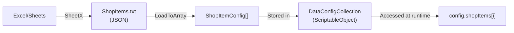

# Static Config Data

## 1. Tổng Quan

**Static Config Data** là dữ liệu cấu hình game — chỉ đọc tại runtime, được quản lý bởi Game Designer thông qua Google Sheets hoặc Excel.

**Luồng hoạt động:**


**SheetX** là công cụ chuyển đổi dữ liệu từ Sheets thành tệp sẵn sàng sử dụng trong Unity:
- **C# Scripts** — IDs, Constants, Localization API (type-safe, auto-generated)
- **JSON Data** — Dữ liệu cấu hình để deserialize vào game

> Designer sửa Sheets → nhấn Export → code tự cập nhật. **Không cần Developer can thiệp.**

**Tài nguyên:**
- 📦 [Tải Example Package](https://github.com/hnb-rabear/hnb-rabear.github.io/blob/main/sheetx/SheetXExample.unitypackage)
- 📊 [Xem trước các kiểu dữ liệu](https://docs.google.com/spreadsheets/d/1_9BqoKwRsod5cMwML5n_pLpuWk045lD3Jd7nrizqVBo/edit?usp=sharing)

### Mục lục

- [2. Cài Đặt Settings](#2-cài-đặt-settings)
- [3. Quy Tắc Thiết Kế Sheet](#3-quy-tắc-thiết-kế-sheet): [IDs](#31-sheet-ids) · [Constants](#32-sheet-constants) · [JSON Data](#33-bảng-dữ-liệu-json) · [Localization](#34-sheet-localization)
- [4. Export Workflow](#4-export-workflow)
- [5. ConfigCollection](#5-configcollection)
- [6. Localization API](#6-localization-api)
- [7. Troubleshooting](#7-troubleshooting)

---

## 2. Cài Đặt Settings

Điều hướng tới: `RCore > SheetX > Settings`


### Các tùy chọn cấu hình

| Tùy chọn | Mô tả |
|---|---|
| **Scripts Output Folder** | Thư mục lưu C# scripts (IDs, Constants, Localization API) |
| **JSON Output Folder** | Thư mục lưu dữ liệu JSON |
| **Localization Output** | Thư mục lưu dữ liệu bản địa hóa (`Resources` hoặc `Addressable`) |
| **Namespace** | Namespace cho các tệp C# được xuất |

### Tùy chọn tách/gộp tệp

| Tùy chọn | TRUE | FALSE |
|---|---|---|
| **Separate IDs Sheets** | Mỗi sheet `[%IDs]` → tệp riêng `[SheetName]IDs.cs` | Gộp tất cả vào `IDs.cs` |
| **Separate Constants Sheets** | Mỗi sheet `[%Constants]` → tệp riêng | Gộp tất cả vào `Constants.cs` |
| **Separate Localization Sheets** | Mỗi sheet `[Localization%]` → nhóm riêng | Gộp tất cả vào `Localization.cs` |

### Tùy chọn khác

| Tùy chọn | Mô tả |
|---|---|
| **Only enum as IDs** | Các cột có đuôi `[enum]` chỉ xuất enum, bỏ qua hằng số Integer |
| **Combine JSON Sheets** | Gộp tất cả bảng dữ liệu từ 1 Excel → 1 tệp JSON `[ExcelName].txt` |
| **Language Character Set** | Biên dịch bảng ký tự cho TextMeshPro (Hàn, Nhật, Trung) |
| **Persistent Fields** | Giữ lại các ô trống khi xuất JSON (mặc định bị loại bỏ) |
| **Google Client ID / Secret** | Credentials từ Google Console để kết nối Google Sheets |

---

## 3. Quy Tắc Thiết Kế Sheet

### 3.1. Sheet IDs

Tên sheet kết thúc bằng `IDs`. Mỗi nhóm được tổ chức trong **3 cột liên tiếp**: Tên Khóa, Giá trị (Integer), Ghi chú.

| Hero   |     |         | Building      |     |         | Pet      |     |         | Gender[enum]      |     |
| ------ | --- | ------- | ------------- | --- | ------- | -------- | --- | ------- | ----------------- | --- |
| HERO_1 | 1   | comment | BUILDING_NULL | 0   | comment | PET_NULL | 0   | comment | GENDER_NONE       | 0   |
| HERO_2 | 2   | comment | BUILDING_1    | 1   |         | PET_1    | 1   |         | GENDER_MALE       | 1   |
| HERO_3 | 3   | comment | BUILDING_2    | 2   |         | PET_2    | 2   |         | GENDER_FEMALE     | 2   |
|        |     |         | BUILDING_3    | 3   |         | PET_3    | 3   |         | GENDER_HELICOPTER | 3   |

**Quy tắc:**
- Tên sheet **phải** kết thúc bằng `IDs`.
- Chỉ cho phép kiểu Integer.
- Hàng đầu tiên chứa tên nhóm.
- Thêm hậu tố `[enum]` vào tên nhóm để xuất dưới dạng `enum` thay vì hằng số.

→ Xuất thành: `IDs.Hero.HERO_1 = 1`, `IDs.Gender` (enum)

### 3.2. Sheet Constants

Tên sheet kết thúc bằng `Constants`. Bao gồm 4 cột: **Tên, Kiểu, Giá trị, Ghi chú**.

| Name                  | Type        | Value               | Comment               |
| --------------------- | ----------- | ------------------- | --------------------- |
| EXAMPLE_INT           | int         | 83                  | Ví dụ Integer         |
| EXAMPLE_FLOAT         | float       | 1.021               | Ví dụ Float           |
| EXAMPLE_STRING        | string      | 321fda              | Ví dụ String          |
| EXAMPLE_INT_ARRAY_1   | int-array   | 4                   | Ví dụ mảng Integer    |
| EXAMPLE_INT_ARRAY_2   | int-array   | 0:3:4:5             | Phân tách bằng `:`    |
| EXAMPLE_FLOAT_ARRAY_1 | float-array | 5                   | Ví dụ mảng Float      |
| EXAMPLE_FLOAT_ARRAY_2 | float-array | 5:1:1:3             | Mảng nhiều phần tử    |
| EXAMPLE_VECTOR2       | vector2     | 1:2                 | Ví dụ Vector2         |
| EXAMPLE_VECTOR3       | vector3     | 3:3:4               | Ví dụ Vector3         |
| EXAMPLE_REFERENCE     | int         | HERO_1              | Tham chiếu đến ID     |
| EXAMPLE_REF_ARRAY     | int-array   | HERO_1 : HERO_2     | Mảng tham chiếu       |
| EXAMPLE_FORMULA       | int         | =1*10*36            | Công thức Excel       |

**Kiểu dữ liệu hỗ trợ:** `int`, `float`, `bool`, `string`, `int-array`, `float-array`, `vector2`, `vector3`

**Phân tách mảng:** Dùng `:`, `|`, hoặc xuống dòng.

→ Xuất thành: `Constants.EXAMPLE_INT = 83`

### 3.3. Bảng Dữ Liệu JSON

Bảng dữ liệu có tên tùy ý (không kết thúc bằng `IDs` hay `Constants`, không bắt đầu bằng `Localization`).

#### Kiểu cơ bản

| numberExample1 | numberExample2 | numberExample3 | boolExample | stringExample |
| -------------- | -------------- | -------------- | ----------- | ------------- |
| 1              | 10             | 1.2            | TRUE        | văn bản       |
| 2              | 20             | 3.1            | TRUE        | văn bản       |
| 3              | BUILDING_8     | 5              | FALSE       | văn bản       |

> Giá trị ô có thể **tham chiếu đến ID** (ví dụ: `BUILDING_8` → giá trị integer tương ứng).

#### Kiểu mở rộng: Mảng và JSON Object

| Quy ước | Cú pháp tên cột | Ví dụ |
|---|---|---|
| **Mảng** | Kết thúc bằng `[]` | `skills[]`, `rewards[]` |
| **JSON Object** | Kết thúc bằng `{}` | `metadata{}`, `config{}` |

| array1[]                | array2[]    | JSON\{}                          |
| ----------------------- | ----------- | -------------------------------- |
| text1                   | 1           | \{}                              |
| text1 \| text2          | 1 \| 2      | \{"id":1, "name":"John Doe"}     |
| text1 \| text2 \| text3 | 1 \| 2 \| 3 | \{"id":HERO_2, "name":"Jane"}    |

**Phân tách phần tử mảng:** Dùng `|` hoặc xuống dòng.

#### Kiểu đặc biệt: Danh sách Thuộc tính (Attributes)

Kiểu dữ liệu dành cho game **RPG** — nơi nhân vật/trang bị có các thuộc tính linh hoạt.

| attribute0 | value0 | unlock0 | increase0 | max0 | attribute1 | value1[] | unlock1[] | increase1[] | max1[]   |
| ---------- | ------ | ------- | --------- | ---- | ---------- | -------- | --------- | ----------- | -------- |
| ATT_HP     | 30     | 2       | 1.2       | 8    |            |          |           |             |          |
| ATT_AGI    | 25     | 3       | 1.5       | 8    |            |          |           |             |          |
| ATT_INT    | 30     | 2       | 1         | 5    | ATT_CRIT   | 3 \| 2   | 0 \| 11   | 0.5 \| 1    | 10 \| 20 |


**Cấu trúc một thuộc tính:**

| Cột | Tên mẫu | Mô tả | Bắt buộc |
|---|---|---|---|
| **attribute** | `attribute0`, `attribute1`... | ID thuộc tính (Integer, từ sheet IDs) | ✅ |
| **value** | `value0` hoặc `value0[]` | Giá trị thuộc tính (số hoặc mảng) | ✅ |
| **increase** | `increase0` hoặc `increase0[]` | Mức tăng khi nâng cấp | Tùy chọn |
| **unlock** | `unlock0` hoặc `unlock0[]` | Điều kiện mở khóa | Tùy chọn |
| **max** | `max0` hoặc `max0[]` | Giá trị tối đa | Tùy chọn |

> Các cột thuộc tính nên đặt ở **cuối bảng**. Index bắt đầu từ 0 và tăng dần.

### 3.4. Sheet Localization

Tên sheet bắt đầu bằng `Localization`. Hai cột khóa: **`idString`** (khóa chính) và **`relativeId`** (khóa phụ, liên kết với sheet IDs).

| idstring     | relativeId | english                   | spanish                        | vietnamese                    |
| ------------ | ---------- | ------------------------- | ------------------------------ | ----------------------------- |
| message_1    |            | this is english message 1 | este es el mensaje en ingles 1 | đây là thông điệp tiếng Anh 1 |
| message_2    |            | this is english message 2 | este es el mensaje en ingles 2 | đây là thông điệp tiếng Anh 2 |
|              |            |                           |                                |                               |
| hero_name    | HERO_1     | hero name 1               | nombre del héroe 1             | tên anh hùng 1                |
| hero_name    | HERO_2     | hero name 2               | nombre del héroe 2             | tên anh hùng 2                |

**Quy tắc:**
- Khóa mỗi hàng = `idString` + `relativeId` (ví dụ: `hero_name_HERO_1`)
- `relativeId` có thể tham chiếu đến ID từ sheet IDs

---

## 4. Export Workflow

### 4.1. Xuất từ Excel

Điều hướng tới: `RCore > SheetX > Excel Spreadsheets`

**Xuất một tệp:**


**Xuất nhiều tệp:**


1. Thêm tất cả tệp Excel cần xử lý.
2. Chọn bao gồm/loại trừ các sheet trong mỗi tệp.
3. Nhấn **Export All** để xử lý toàn bộ.

### 4.2. Xuất từ Google Sheets

Điều hướng tới: `RCore > SheetX > Google Spreadsheets`

**Thiết lập credentials:** [Hướng dẫn lấy Google Client ID và Secret](https://hnb-rabear.github.io/sheetx/how-get-google-client-id-and-secret-id)


Nhập **Google Sheet ID** (tìm trong URL) và nhấn **Download**:

```
https://docs.google.com/spreadsheets/d/[GOOGLE_SHEET_ID]/edit?......
                                        ^^^^^^^^^^^^^^^^
                                        Đây là Sheet ID
```


**Xuất nhiều Spreadsheets:**


### 4.3. Kết quả Export

| Đầu ra | Thư mục | Mô tả |
|---|---|---|
| Script C# | `Assets/Scripts/Generated/` | IDs.cs, Constants.cs, Localization API |
| JSON Data | `Assets/DataConfig/` | Dữ liệu config ở dạng JSON |
| Localization | `Assets/Resources/Localizations/` | Các tệp ngôn ngữ `.txt` |

---

## 5. ConfigCollection

`ConfigCollection` là lớp cơ sở (`ScriptableObject`) từ RCore để chứa **dữ liệu cấu hình tĩnh** từ tệp JSON. Nó cung cấp phương thức `LoadToArray<T>()` để deserialize JSON thành mảng C#.

### 5.1. Tạo Serializable classes

Tạo các lớp `[Serializable]` tương ứng với cấu trúc bảng dữ liệu:

```csharp
[Serializable]
public class ShopItemConfig : RewardsConfig
{
    public int id;
    public string name;
    public string packId;
    public float price;
    public bool limited;
}

[Serializable]
public class ConsumableItemConfig
{
    public string name;
    public string description;
    public int price;
    public int requiredLevel;
}

// Sử dụng kế thừa để tái sử dụng các trường chung
[Serializable]
public class BoosterItemConfig : ConsumableItemConfig
{
    public IDs.Booster id;
}

[Serializable]
public class PowerUpItemConfig : ConsumableItemConfig
{
    public IDs.PowerUp id;
}
```

### 5.2. Tạo ConfigCollection

```csharp
[CreateAssetMenu(fileName = "DataConfigCollection", menuName = "LiveOps/Create DataConfigCollection")]
public class DataConfigCollection : ConfigCollection
{
    public ShopItemConfig[] shopItems;
    public BoosterItemConfig[] boosterItems;
    public PowerUpItemConfig[] powerUpItems;

    // Override để load JSON vào các mảng
    public override void LoadData()
    {
        shopItems = LoadToArray<ShopItemConfig>("ShopItems");
        boosterItems = LoadToArray<BoosterItemConfig>("Boosters");
        powerUpItems = LoadToArray<PowerUpItemConfig>("PowerUps");
    }
}
```

### 5.3. Tạo asset và nạp dữ liệu

1. Trong Unity Editor: `Assets > Create > LiveOps > Create DataConfigCollection`
2. Nhấn nút **Load** trong Inspector để nạp dữ liệu JSON

**Luồng hoàn chỉnh:**



**Đặc điểm:**
- Hỗ trợ tải từ `Resources` (runtime) hoặc `AssetDatabase` (Editor)
- ScriptableObject → serialized trong build, không cần load JSON lúc runtime
- Nút **Load/Refresh** trong Inspector để cập nhật data

### 5.4. Truy xuất dữ liệu tại runtime

Để truy xuất config data từ bất kỳ đâu trong game, sử dụng **Singleton pattern**:

```csharp
[CreateAssetMenu(fileName = "DataConfigCollection", menuName = "LiveOps/Create DataConfigCollection")]
public partial class DataConfigCollection : ConfigCollection
{
    private static DataConfigCollection m_Instance;
    public static DataConfigCollection Instance
    {
        get
        {
            if (m_Instance == null)
            {
                m_Instance = Resources.Load<DataConfigCollection>(nameof(DataConfigCollection));
                m_Instance.Init();
            }
            return m_Instance;
        }
    }

    public ShopItemConfig[] shopItems;
    public NotificationConfig[] notifications;

    private void Init()
    {
        // Khởi tạo runtime data nếu cần
    }

    public override void LoadData()
    {
        shopItems = LoadToArray<ShopItemConfig>("ShopItems");
        notifications = LoadToArray<NotificationConfig>("Notifications");
    }

    // Helper methods — tìm item theo điều kiện
    public ShopItemConfig GetShopItem(int id)
    {
        return shopItems.Find(x => x.id == id);
    }

    public ShopItemConfig GetShopItem(string packId)
    {
        return shopItems.Find(x => x.packId == packId);
    }
}
```

**Sử dụng trong game:**

```csharp
// Truy xuất từ bất kỳ đâu
var config = DataConfigCollection.Instance;
var item = config.GetShopItem(IDs.Shop.COIN_PACK_1);
var price = item.price;

// Hoặc truy xuất trực tiếp
var allItems = DataConfigCollection.Instance.shopItems;
```

> **Lưu ý:** File ScriptableObject asset phải nằm trong thư mục `Resources` để `Resources.Load<T>()` hoạt động. Nếu dùng **Addressable Assets**, thay bằng load async.

> **Tip:** Sử dụng `partial class` để chia `DataConfigCollection` theo feature — mỗi file chứa data và load logic cho 1 tính năng:

```csharp
// DataConfigCollection.cs — gọi các partial methods
public partial class DataConfigCollection : ConfigCollection
{
    public override void LoadData()
    {
        LoadData_Shop();
        LoadData_WeeklyContest();
    }

    partial void LoadData_Shop();
    partial void LoadData_WeeklyContest();
}

// DataConfigCollection.WeeklyContest.cs — feature riêng
public partial class DataConfigCollection
{
    public WeeklyContestConfig[] weeklyContestConfigs;

    partial void LoadData_WeeklyContest()
    {
        weeklyContestConfigs = LoadToArray<WeeklyContestConfig>("WeeklyContest");
    }
}
```

---

## 6. Localization API

### 6.1. Setup

```csharp
LocalizationsManager.Init();
LocalizationsManager.CurrentLanguage = "jp"; // Thay đổi ngôn ngữ
LocalizationsManager.OnLanguageChanged += OnLanguageChanged; // Đăng ký sự kiện
```

### 6.2. Truy xuất nội dung (3 cách)

**Cách 1 — Truy xuất bằng key** (không tự cập nhật khi đổi ngôn ngữ):

```csharp
m_text1.text = Localization.Get(Localization.GO_TO_SHOP).ToString();
m_text2.text = Localization.Get(Localization.REQUIRED_LEVEL_X, 10).ToString();
m_text3.text = Localization.Get("REQUIRED_LEVEL_X", 25).ToString();
```

**Cách 2 — Dynamic Text** (tự động cập nhật khi đổi ngôn ngữ):

```csharp
// Đăng ký
Localization.RegisterDynamicText(m_text1.gameObject, Localization.TAP_TO_COLLECT);
Localization.RegisterDynamicText(m_text2.gameObject, Localization.REQUIRED_LEVEL_X, "3");

// Hủy đăng ký
Localization.UnregisterDynamicText(m_textGameObject);
```

**Cách 3 — Component** (kéo thả trong Inspector):


### 6.3. Font cho ngôn ngữ CJK

Sử dụng các tệp bộ ký tự tự động tạo từ sheet localization:

| Ngôn ngữ | Font gợi ý |
|---|---|
| Tiếng Nhật | NotoSerif-Bold |
| Tiếng Hàn | NotoSerifKR-Bold |
| Tiếng Trung | NotoSerifTC-Bold |

**Cách tạo:**
1. Mở **Font Asset Creator** trong Unity.
2. Chọn **Character Set** → *Character From File*.
3. Chọn tệp bộ ký tự phù hợp (ví dụ: `characters_set_jp`).


### 6.4. Addressable Assets

1. Cài đặt **Addressable Assets System**.
2. Thêm `ADDRESSABLES` vào scripting define symbols.
3. Di chuyển thư mục Localizations **ra khỏi** `Resources`.
4. Cập nhật đường dẫn trong SheetX Settings.
5. Đánh dấu thư mục Localizations là **Addressable Asset**.


---

## 7. Troubleshooting

| Vấn đề | Nguyên nhân | Giải pháp |
|---|---|---|
| Export lỗi "File not found" | Thư mục output chưa tồn tại | Tạo thư mục trước khi export |
| JSON file trống sau export | Sheet không đúng naming convention | Kiểm tra tên sheet không kết thúc bằng `IDs`/`Constants` và không bắt đầu bằng `Localization` |
| ID tham chiếu sai giá trị | Tên ID bị đánh sai hoặc chưa export sheet IDs | Export sheet IDs trước, sau đó export JSON |
| Google Auth thất bại | Client ID/Secret sai hoặc hết hạn | Tạo lại credentials từ Google Console |
| `LoadToArray<T>()` trả về null | Tên parameter không khớp tên file JSON | Đảm bảo tên truyền vào `LoadToArray()` khớp chính xác tên file JSON (không có extension) |
| Localization không hiển thị | Chưa gọi `LocalizationsManager.Init()` | Gọi Init ở đầu game hoặc trong Awake |
| Ký tự CJK bị ☐ | Font chưa có bộ ký tự tương ứng | Tạo Font Asset với character set từ file được export |
