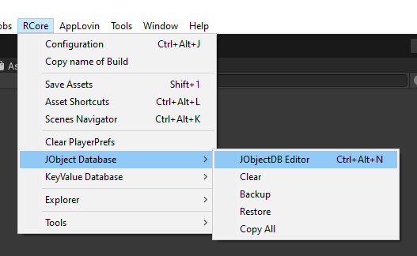
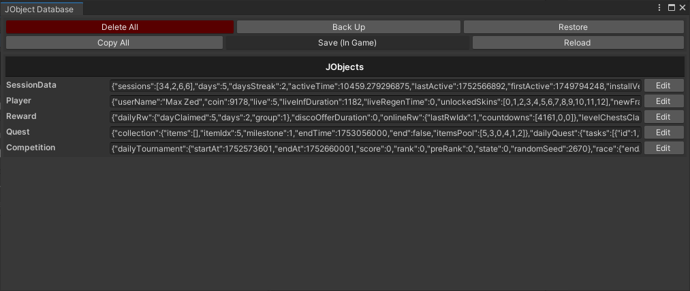
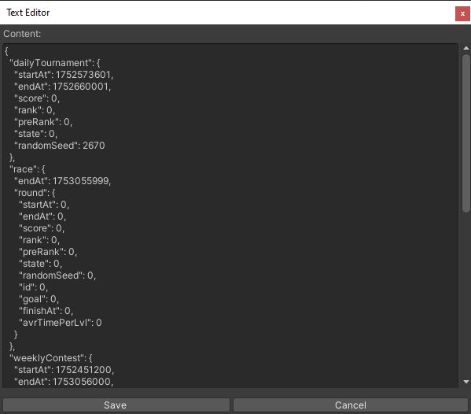
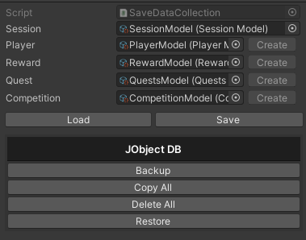
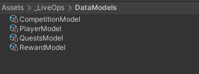
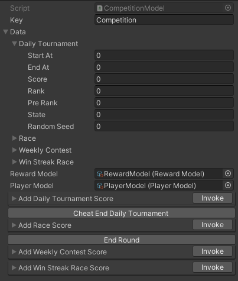

# Quy trình cơ bản Xây dựng Dự án Unity

Tài liệu này cung cấp hướng dẫn chi tiết để xây dựng một dự án Unity sử dụng framework **RCore** và công cụ **SheetX**, tuân theo **kiến trúc phân lớp (Layered Architecture)** và mô hình **MVP (Model-View-Presenter)**. Dự án sẽ được thiết kế để đảm bảo sự tách biệt rõ ràng giữa các thành phần, dễ dàng bảo trì, mở rộng và hỗ trợ làm việc nhóm giữa **Game Developer** và **Game Designer**.

Trước khi bắt đầu, hãy xem qua các tài liệu bên dưới:
- **Architecture**: [Link](https://hnb-rabear.github.io/project_basic_setup/project_architect)
- **SheetX**: [Link](https://hnb-rabear.github.io/project_basic_setup/sheetx)
- **RCore**: [Link](https://hnb-rabear.github.io/project_basic_setup/rcore)

## 1. Cài đặt Các Công cụ và Thư viện

### 1.1. Yêu cầu Cài đặt
Để bắt đầu, bạn cần cài đặt các thư viện sau thông qua **Unity Package Manager (UPM)** bằng cách thêm các Git URL:

- **UniTask** (Thư viện phụ thuộc)
	```
	https://github.com/Cysharp/UniTask.git?path=src/UniTask/Assets/Plugins/UniTask
	```
- **RCore**
  ```
  https://github.com/hnb-rabear/RCore.git?path=Assets/RCore/Main
  ```
- **SheetX**
  ```
  https://github.com/hnb-rabear/RCore.git?path=Assets/RCore.SheetX
  ```
-	**SheetX Winform**
	```
	https://github.com/hnb-rabear/excel-to-unity
	```

### 1.2. Thiết lập Thư mục (tùy chọn)
Tạo các thư mục sau trong dự án Unity để lưu trữ các tệp xuất từ SheetX:
- `Assets/Scripts/Generated`: Lưu trữ các script C# (ID, Constants, Localization).
- `Assets/DataConfig`: Lưu trữ các tệp dữ liệu JSON.
- `Assets/Resources/Localizations`: Lưu trữ dữ liệu bản địa hóa (hoặc sử dụng thư mục `Localizations` cho Addressable Assets).

Cấu hình các thư mục này trong cửa sổ **SheetX Settings**:
1. Điều hướng đến `RCore > SheetX > Settings`.
2. Thiết lập:
   - **Scripts Output Folder**: `Assets/Scripts/Generated`
   - **JSON Output Folder**: `Assets/DataConfig`
   - **Localization Output**: `Assets/Resources/Localizations` (hoặc `Assets/Localizations` nếu dùng Addressable Assets).

### 1.3. Cấu hình Google Sheets
Nếu sử dụng Google Sheets để quản lý dữ liệu:
1. Lấy **Google Client ID** và **Google Client Secret** từ Google Console ([Hướng dẫn](https://hnb-rabear.github.io/sheetx/how-get-google-client-id-and-secret-id)).
2. Dán vào các trường tương ứng trong `RCore > SheetX > Settings`.
3. Thêm ID Google Sheet vào `RCore > SheetX > Google Spreadsheets` để xuất dữ liệu.

-------------------------------------------------------

## 2. Xây dựng hệ thống quản lý Data và Config

Dự án được xây dựng theo mô hình **Layered Architecture** với các lớp: **Data Model**, **Data Handler**, **Presenter**, và **View**. Các bước dưới đây sẽ hướng dẫn cách tích hợp **SheetX** và **RCore** để quản lý dữ liệu, tài sản, và bản địa hóa.

### 2.1. Xây dựng Hệ thống Quản lý Dữ liệu Cấu hình (Data Config)

Hệ thống quản lý dữ liệu cấu hình được thiết kế để Game Designer có thể tự do chỉnh sửa dữ liệu thông qua **Google Sheets** hoặc **Excel** mà không cần sự can thiệp của Game Developer.

#### 2.1.1. Thiết kế Bảng Dữ liệu
Tạo các bảng dữ liệu trong Google Sheets hoặc Excel theo các quy tắc của SheetX:
- **Sheet ID**: Đặt tên sheet kết thúc bằng `IDs` (ví dụ: `HeroIDs`, `ItemIDs`). Mỗi sheet chứa các cột: Tên Khóa, Giá trị Khóa (Integer), và Ghi chú. Ví dụ:
  ```markdown
  | Hero   |     |         |
  | ------ | --- | ------- |
  | HERO_1 | 1   | comment |
  | HERO_2 | 2   | comment |
  ```
- **Sheet Constants**: Đặt tên sheet kết thúc bằng `Constants`. Bao gồm các cột: Tên, Kiểu, Giá trị, Ghi chú. Hỗ trợ các kiểu dữ liệu như `int`, `float`, `string`, `int-array`, `vector2`, v.v. Ví dụ:
  ```markdown
  | Name           | Type  | Value | Comment         |
  | -------------- | ----- | ----- | --------------- |
  | MAX_HEALTH     | int   | 100   | Maximum health  |
  | MOVEMENT_SPEED | float | 5.5   | Player speed    |
  ```
- **Sheet Data (JSON)**: Chứa dữ liệu cấu hình game, hỗ trợ các kiểu dữ liệu cơ bản (Boolean, Number, String), mảng, và đối tượng JSON. Ví dụ:
  ```markdown
  | id | name   | health | attack |
  | -- | ------ | ------ | ------ |
  | 1  | Hero1  | 100    | 10     |
  | 2  | Hero2  | 120    | 15     |
  ```
- **Sheet Localization**: Đặt tên sheet bắt đầu bằng `Localization`. Bao gồm cột `idString`, `relativeId`, và các cột ngôn ngữ (ví dụ: `english`, `vietnamese`). Ví dụ:
  ```markdown
  | idString  | relativeId | english       | vietnamese       |
  | --------- | ---------- | ------------- | ---------------- |
  | hero_name | HERO_1     | Hero One      | Anh hùng Một     |
  | hero_name | HERO_2     | Hero Two      | Anh hùng Hai     |
  ```

#### 2.1.2. Xuất Dữ liệu từ SheetX
1. Điều hướng đến `RCore > SheetX > Excel Spreadsheets` hoặc `Google Spreadsheets`.
2. Thêm các tệp Excel hoặc ID Google Sheet.
3. Chọn các sheet cần xuất và nhấn **Export All** để tạo:
   - Các script C# (ID, Constants, Localization) trong `Assets/Scripts/Generated`.
   - Các tệp JSON trong `Assets/DataConfig`.
   - Dữ liệu bản địa hóa trong `Assets/Resources/Localizations`.

#### 2.1.3. Tạo ScriptableObject cho Data Config
Tạo một `ScriptableObject` để lưu trữ dữ liệu cấu hình tĩnh, sử dụng `ConfigCollection` từ RCore.

```cs
[CreateAssetMenu(fileName = "DataConfigCollection", menuName = "LiveOps/Create DataConfigCollection")]
public class DataConfigCollection : ConfigCollection
{
	public ShopItemConfig[] shopItems;
	public BoosterItemConfig[] boosterItems;
	public PowerUpItemConfig[] powerUpItems;
}

[Serializable]
public class ShopItemConfig : RewardsConfig
{
	public int id;
	public string name;
	public string packId;
	public float price;
	public bool limited;
}

[Serializable]
public class ConsumableItemConfig
{
	public string name;
	public string description;
	public int price;
	public int requiredLevel;
}

[Serializable]
public class BoosterItemConfig : ConsumableItemConfig
{
	public IDs.Booster id;
}

[Serializable]
public class PowerUpItemConfig : ConsumableItemConfig
{
	public IDs.PowerUp id;
}
```

Tải load JSON data vào `DataConfigCollection`:

```cs
public override void LoadData()
{
	shopItems = LoadToArray<ShopItemConfig>("ShopItems");
	boosterItems = LoadToArray<BoosterItemConfig>("Boosters");
	powerUpItems = LoadToArray<PowerUpItemConfig>("PowerUps");
}
```

### 2.2. Hệ thống Quản lý User Data

Sử dụng **JObjectDB** từ RCore để quản lý dữ liệu người chơi.

#### 2.2.1. Tạo Data Model

```cs
Tạo lớp `PlayerData` để chứa dữ liệu:
[Serializable]
public partial class PlayerData : JObjectData
{
	public string userName;
	public int coin;
	public int live;
	public int liveInfDuration;
	public int liveRegenTime;
}
```

#### 2.2.2. Tạo Data Handler
Tạo lớp `PlayerModel` để quản lý logic xử lý dữ liệu:
```cs
public partial class PlayerModel : JObjectModel<PlayerData>
{
	public override void Init() { }
	public override void OnPause(bool pause, int utcNowTimestamp, int offlineSeconds) { }
	public override void OnPostLoad(int utcNowTimestamp, int offlineSeconds) { }
	public override void OnUpdate(float deltaTime) { }
	public override void OnPreSave(int utcNowTimestamp) { }
	public override void OnRemoteConfigFetched() { }
}
```

#### 2.2.3. Tạo Save Data Collection
Tạo lớp `SaveDataCollection` kế thừa ScriptableObject `JObjectModelCollection` để quản lý tất cả Data Handlers
```cs
public class SaveDataCollection : JObjectModelCollection
{
	[CreateScriptableObject] public PlayerModel player;
	[CreateScriptableObject] public QuestsModel quest;
	[CreateScriptableObject] public CompetitionModel competition;

	public override void Load() { }
	public override void PostLoad() { }
}
```

#### 2.2.4. Tạo Data Manager
Tạo một DontDestroyObject GameObject và Thêm `DBManager` component hoặc tạo một lớp `DataManager` kế thừa `DBManager`
```cs
public class DataManager : DBManager
{
	private static DataManager m_Instance;
	public static DataManager Instance
	{
		get
		{
			if (m_Instance == null)
			{
				m_Instance = FindObjectOfType<DataManager>();
			}
			return m_Instance;
		}
	}
}
```

### 2.3. Công cụ hỗ trợ quản lý Data

#### 2.3.1. JObjectDB Editor

Đây là công cụ để xem và chỉnh sửa trực tiếp dữ liệu người dùng dưới dạng JSON.

* **Truy cập:** RCore > JObject Database > JObjectDB Editor.



* **Chức năng chính:**
    * Hiển thị toàn bộ dữ liệu người dùng (`Player`, `Quest`, `SessionData`, v.v.) dưới dạng JSON.
    * Cho phép **chỉnh sửa** trực tiếp từng mục dữ liệu thông qua một cửa sổ "Text Editor".
    * Cung cấp các tiện ích như **Delete All**, **Back Up**, **Restore**,... để quản lý dữ liệu test một cách hiệu quả.





#### 2.3.2. Trình quản lý Data Model qua ScriptableObject `JObjectModelCollection`



#### 2.3.3. Chỉnh sửa dữ liệu trực tiếp qua ScriptableObject





## 3. LiveOps Template Project

Để có thể hình dung ra luồng hoạt động của một dự án tích hợp RCore và SheetX, bạn có thể tham khảo Repository dưới đây.

https://gitlab.ikameglobal.com/hungnb/liveopstemplate.git