# Quy Trình Xây Dựng Dự Án Unity

## Giới thiệu

Tài liệu này hướng dẫn cách xây dựng hệ thống quản lý data trong một dự án Unity, sử dụng framework **RCore** và công cụ **SheetX**.

**Vấn đề cần giải quyết:**

Trong phát triển game, data là nền tảng của mọi thứ — từ chỉ số nhân vật, giá vật phẩm, đến nội dung bản địa hóa. Nếu không có hệ thống quản lý data tốt:
- Game Designer phải nhờ Developer sửa code mỗi khi muốn thay đổi một con số.
- Dữ liệu người chơi (save data) dễ bị lỗi, mất mát, hoặc không migrate được khi cập nhật.
- Code trở nên rối rắm khi logic game, dữ liệu và giao diện trộn lẫn vào nhau.

**Giải pháp:**

Kiến trúc **phân lớp (Layered Architecture)** kết hợp mô hình **MVP (Model-View-Presenter)**, sử dụng hai hệ thống data riêng biệt:

| Loại Data | Công cụ | Đặc điểm | Ví dụ |
|---|---|---|---|
| **Static Config Data** | SheetX + `ConfigCollection` | Chỉ đọc, do Designer quản lý qua Sheets | Chỉ số Hero, giá vật phẩm, level design |
| **Dynamic Player Data** | JObjectDB + `JObjectModel` | Đọc/ghi, lưu tiến trình người chơi | Gold, level, inventory, quest progress |

### Tài liệu tham khảo

| Tài liệu | Nội dung |
|---|---|
| [**Architecture**](project_architect) | Kiến trúc phân lớp, MVP, luồng hoạt động mẫu |
| [**SheetX**](sheetx) | Công cụ quản lý data config từ Excel/Google Sheets |
| [**RCore**](rcore) | Framework cung cấp các hệ thống nền tảng |

### Mục lục

- [1. Cài Đặt Công Cụ và Thư Viện](#1-cài-đặt-công-cụ-và-thư-viện)
- [2. Xây Dựng Hệ Thống Quản Lý Data](#2-xây-dựng-hệ-thống-quản-lý-data)
  - [2.1. Hệ Thống Static Config Data](#21-hệ-thống-static-config-data)
  - [2.2. Hệ Thống Dynamic Player Data](#22-hệ-thống-dynamic-player-data)
  - [2.3. Công Cụ Hỗ Trợ Quản Lý Data](#23-công-cụ-hỗ-trợ-quản-lý-data)
- [3. LiveOps Template Project](#3-liveops-template-project)

---

## 1. Cài Đặt Công Cụ và Thư Viện

### 1.1. Yêu cầu cài đặt

Cài đặt các thư viện sau thông qua **Unity Package Manager (UPM)** bằng cách chọn *"Add package from git URL..."*:

| Thư viện | Git URL | Ghi chú |
|---|---|---|
| **UniTask** | `https://github.com/Cysharp/UniTask.git?path=src/UniTask/Assets/Plugins/UniTask` | Thư viện phụ thuộc, cần cài trước |
| **RCore** | `https://github.com/hnb-rabear/RCore.git?path=Assets/RCore/Main` | Framework chính |
| **SheetX** | `https://github.com/hnb-rabear/RCore.git?path=Assets/RCore.SheetX` | Công cụ quản lý data config |

> **Lưu ý:** SheetX cũng có phiên bản **Winform** độc lập tại [excel-to-unity](https://github.com/hnb-rabear/excel-to-unity), phù hợp khi muốn xử lý data ngoài Unity Editor.

### 1.2. Thiết lập thư mục xuất dữ liệu

Tạo các thư mục sau trong dự án Unity để lưu trữ các tệp xuất từ SheetX:

```
Assets/
├── Scripts/Generated/     ← Script C# (IDs, Constants, Localization API)
├── DataConfig/            ← Tệp dữ liệu JSON
└── Resources/
    └── Localizations/     ← Dữ liệu bản địa hóa
```

Cấu hình các thư mục trong cửa sổ SheetX Settings:

1. Điều hướng tới `RCore > SheetX > Settings`.
2. Thiết lập:
   - **Scripts Output Folder**: `Assets/Scripts/Generated`
   - **JSON Output Folder**: `Assets/DataConfig`
   - **Localization Output**: `Assets/Resources/Localizations`

<!-- 📸 TODO: Thêm screenshot cửa sổ SheetX Settings với 3 trường output đã được cấu hình.
     Có thể dùng lại hình từ trang SheetX nếu phù hợp. -->

> Nếu sử dụng **Addressable Assets**, đặt thư mục Localization bên ngoài `Resources` (ví dụ: `Assets/Localizations`) và đánh dấu là Addressable Asset.

### 1.3. Cấu hình Google Sheets (tùy chọn)

Nếu sử dụng Google Sheets thay vì Excel:

1. Lấy **Google Client ID** và **Client Secret** từ Google Console ([Hướng dẫn](https://hnb-rabear.github.io/sheetx/how-get-google-client-id-and-secret-id)).
2. Dán vào các trường tương ứng trong `RCore > SheetX > Settings`.
3. Thêm ID Google Sheet vào `RCore > SheetX > Google Spreadsheets` để xuất dữ liệu.

---

## 2. Xây Dựng Hệ Thống Quản Lý Data

Phần này hướng dẫn cách xây dựng hai hệ thống data chính: **Static Config Data** (dữ liệu cấu hình) và **Dynamic Player Data** (dữ liệu người chơi).

<!-- 📸 TODO: Thay ASCII diagram bên dưới bằng hình ảnh thực (draw.io hoặc Figma).
     Gợi ý: 2 cột song song: Static Config Data (Excel → SheetX → JSON → ConfigCollection → Runtime)
     và Dynamic Player Data (JObjectData → JObjectModel → JSON ↔ PlayerPrefs → Runtime).
     Màu sắc phân biệt 2 luồng. -->

```
┌──────────────────────────────────────────────────────────────────────┐
│                        DATA MANAGEMENT SYSTEM                        │
│                                                                      │
│  ┌─────────────────────────────┐  ┌────────────────────────────────┐│
│  │  📊 STATIC CONFIG DATA     │  │  💾 DYNAMIC PLAYER DATA        ││
│  │                             │  │                                ││
│  │  Google Sheets / Excel      │  │  PlayerData, QuestData, ...    ││
│  │       ↓ (SheetX Export)     │  │       ↓ (JObjectDB)           ││
│  │  JSON + C# IDs/Constants    │  │  JSON ↔ PlayerPrefs           ││
│  │       ↓ (Deserialize)       │  │       ↓ (Auto Save/Load)      ││
│  │  ConfigCollection (SO)      │  │  JObjectModel (SO)            ││
│  │       ↓ (Read-Only)         │  │       ↓ (Read/Write + Logic)  ││
│  │  Game Runtime               │  │  Game Runtime                 ││
│  └─────────────────────────────┘  └────────────────────────────────┘│
└──────────────────────────────────────────────────────────────────────┘
```

### 2.1. Hệ Thống Static Config Data

Hệ thống này cho phép **Game Designer tự do chỉnh sửa dữ liệu** thông qua Google Sheets hoặc Excel, **không cần sự can thiệp của Developer**.

#### 2.1.1. Thiết kế bảng dữ liệu

Tạo bảng dữ liệu theo các quy tắc đặt tên của SheetX:

**Sheet IDs** — Đặt tên kết thúc bằng `IDs` (ví dụ: `HeroIDs`, `ItemIDs`):

| Hero   | Key | Comment |
| ------ | --- | ------- |
| HERO_1 | 1   | Warrior |
| HERO_2 | 2   | Mage    |
| HERO_3 | 3   | Archer  |

→ Xuất thành hằng số C#: `IDs.Hero.HERO_1 = 1`

**Sheet Constants** — Đặt tên kết thúc bằng `Constants`:

| Name           | Type      | Value | Comment        |
| -------------- | --------- | ----- | -------------- |
| MAX_HEALTH     | int       | 100   | Maximum health |
| MOVEMENT_SPEED | float     | 5.5   | Player speed   |
| START_ITEMS    | int-array | 1:2:3 | Default items  |

→ Xuất thành: `Constants.MAX_HEALTH = 100`

**Sheet Data (JSON)** — Tên tùy ý, chứa dữ liệu cấu hình game:

| id | name   | health | attack | skills[]  |
| -- | ------ | ------ | ------ | --------- |
| 1  | Hero1  | 100    | 10     | 1 \| 2    |
| 2  | Hero2  | 120    | 15     | 2 \| 3    |

→ Xuất thành tệp JSON, deserialize vào C# class

**Sheet Localization** — Đặt tên bắt đầu bằng `Localization`:

| idString  | relativeId | english  | vietnamese   |
| --------- | ---------- | -------- | ------------ |
| hero_name | HERO_1     | Hero One | Anh hùng Một |
| hero_name | HERO_2     | Hero Two | Anh hùng Hai |

→ Khóa `hero_name + HERO_1` tự động liên kết với ID

> 📖 Xem chi tiết tất cả quy tắc và kiểu dữ liệu nâng cao (Array, JSON Object, Attribute) trong [tài liệu SheetX](sheetx).

#### 2.1.2. Xuất dữ liệu

1. Điều hướng tới `RCore > SheetX > Excel Spreadsheets` hoặc `Google Spreadsheets`.
2. Thêm tệp Excel hoặc ID Google Sheet.
3. Nhấn **Export All** để tạo:

| Đầu ra | Thư mục | Mô tả |
|---|---|---|
| Script C# | `Assets/Scripts/Generated/` | IDs.cs, Constants.cs, Localization API |
| JSON Data | `Assets/DataConfig/` | Dữ liệu config ở dạng JSON |
| Localization Data | `Assets/Resources/Localizations/` | Các tệp ngôn ngữ `.txt` |

#### 2.1.3. Tạo ScriptableObject chứa Config Data

**Bước 1:** Tạo các lớp `[Serializable]` tương ứng với cấu trúc bảng dữ liệu:

```csharp
[Serializable]
public class ShopItemConfig : RewardsConfig
{
    public int id;
    public string name;
    public string packId;
    public float price;
    public bool limited;
}

[Serializable]
public class ConsumableItemConfig
{
    public string name;
    public string description;
    public int price;
    public int requiredLevel;
}

[Serializable]
public class BoosterItemConfig : ConsumableItemConfig
{
    public IDs.Booster id;
}

[Serializable]
public class PowerUpItemConfig : ConsumableItemConfig
{
    public IDs.PowerUp id;
}
```

> **Tip:** Sử dụng **kế thừa** (`ConsumableItemConfig`) để tái sử dụng các trường chung (name, price, requiredLevel) giữa các loại item.

**Bước 2:** Tạo `ConfigCollection` (ScriptableObject) để chứa tất cả config:

```csharp
[CreateAssetMenu(fileName = "DataConfigCollection", menuName = "LiveOps/Create DataConfigCollection")]
public class DataConfigCollection : ConfigCollection
{
    public ShopItemConfig[] shopItems;
    public BoosterItemConfig[] boosterItems;
    public PowerUpItemConfig[] powerUpItems;

    // Override để load JSON vào các mảng
    public override void LoadData()
    {
        shopItems = LoadToArray<ShopItemConfig>("ShopItems");
        boosterItems = LoadToArray<BoosterItemConfig>("Boosters");
        powerUpItems = LoadToArray<PowerUpItemConfig>("PowerUps");
    }
}
```

**Bước 3:** Trong Unity Editor, tạo asset từ menu: `Assets > Create > LiveOps > Create DataConfigCollection`, sau đó nhấn nút **Load** trong Inspector để nạp dữ liệu JSON.

> `ConfigCollection` là lớp cơ sở từ RCore. Nó cung cấp phương thức `LoadToArray<T>()` để deserialize JSON file thành mảng C#. Xem thêm trong [tài liệu RCore](rcore#data-config-management).

---

### 2.2. Hệ Thống Dynamic Player Data

Sử dụng **JObjectDB** từ RCore để quản lý dữ liệu người chơi. Hệ thống này cung cấp: auto-save, lifecycle hooks, và ScriptableObject-based editor tools.

#### 2.2.1. Tạo Data Model

Data Model là lớp POCO chỉ chứa dữ liệu, kế thừa `JObjectData`:

```csharp
[Serializable]
public partial class PlayerData : JObjectData
{
    public string userName;
    public int coin;
    public int live;
    public int liveInfDuration;
    public int liveRegenTime;
}
```

> **Tip:** Dùng `partial class` để chia file lớn mà không phá vỡ cấu trúc.

#### 2.2.2. Tạo Data Handler

Data Handler (kế thừa `JObjectModel<T>`) chứa **logic nghiệp vụ** và **lifecycle hooks**:

```csharp
public partial class PlayerModel : JObjectModel<PlayerData>
{
    public override void Init() { }

    public override void OnPostLoad(int utcNowTimestamp, int offlineSeconds)
    {
        // Tính toán phần thưởng offline
    }

    public override void OnUpdate(float deltaTime)
    {
        // Cập nhật timer mỗi frame (ví dụ: regenerate lives)
    }

    public override void OnPause(bool pause, int utcNowTimestamp, int offlineSeconds)
    {
        // Lưu timestamp khi app vào background
    }

    public override void OnPreSave(int utcNowTimestamp)
    {
        // Validate data trước khi lưu
    }

    public override void OnRemoteConfigFetched()
    {
        // Sync khi nhận Remote Config từ server
    }
}
```

**Lifecycle Hooks — Khi nào được gọi?**

| Hook | Thời điểm | Ví dụ sử dụng |
|---|---|---|
| `Init()` | Lần đầu tạo data | Set giá trị mặc định cho player mới |
| `OnPostLoad()` | Sau khi load data | Tính offline reward (bao nhiêu giờ rời game?) |
| `OnUpdate()` | Mỗi frame | Đếm ngược regenerate lives |
| `OnPause()` | App vào background | Lưu timestamp hiện tại |
| `OnPreSave()` | Trước khi save | Clean up, validate data |
| `OnRemoteConfigFetched()` | Nhận Remote Config | Sync server-side balance |

#### 2.2.3. Tạo Save Data Collection

`SaveDataCollection` kế thừa `JObjectModelCollection` để quản lý **tất cả Data Handlers** trong game:

```csharp
public class SaveDataCollection : JObjectModelCollection
{
    [CreateScriptableObject] public PlayerModel player;
    [CreateScriptableObject] public QuestsModel quest;
    [CreateScriptableObject] public CompetitionModel competition;

    public override void Load() { }
    public override void PostLoad() { }
}
```

> `[CreateScriptableObject]` là attribute từ RCore — tự thêm nút "Create" trong Inspector để tạo ScriptableObject nhanh.

#### 2.2.4. Tạo Data Manager

Tạo `DataManager` kế thừa `DBManager`, đặt trên `DontDestroyOnLoad` GameObject. Đây là component điều phối auto-save, auto-load cho toàn bộ hệ thống:

```csharp
public class DataManager : DBManager
{
    private static DataManager m_Instance;
    public static DataManager Instance
    {
        get
        {
            if (m_Instance == null)
                m_Instance = FindObjectOfType<DataManager>();
            return m_Instance;
        }
    }
}
```

---

### 2.3. Công Cụ Hỗ Trợ Quản Lý Data

RCore cung cấp các Editor Tools giúp debug và chỉnh sửa dữ liệu nhanh chóng trong quá trình phát triển.

#### 2.3.1. JObjectDB Editor

Công cụ xem và chỉnh sửa dữ liệu người chơi dưới dạng JSON ngay trong Unity Editor.

**Truy cập:** `RCore > JObject Database > JObjectDB Editor`

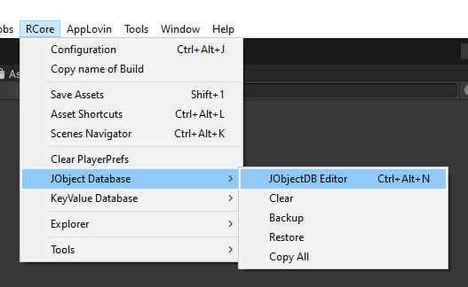

**Chức năng chính:**
- Hiển thị toàn bộ dữ liệu (`Player`, `Quest`, `SessionData`...) dưới dạng JSON.
- Chỉnh sửa trực tiếp từng mục qua cửa sổ "Text Editor".
- Các tiện ích: **Delete All**, **Back Up**, **Restore** để quản lý dữ liệu test.


#### 2.3.2. Trình quản lý Data Model qua ScriptableObject

`JObjectModelCollection` cho phép quản lý trực quan tất cả Data Handlers:

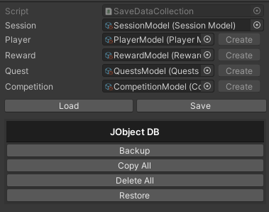

#### 2.3.3. Chỉnh sửa dữ liệu qua ScriptableObject Inspector

Mỗi `JObjectModel` hiển thị dữ liệu trực tiếp trong Inspector, hỗ trợ chỉnh sửa nhanh:

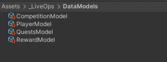

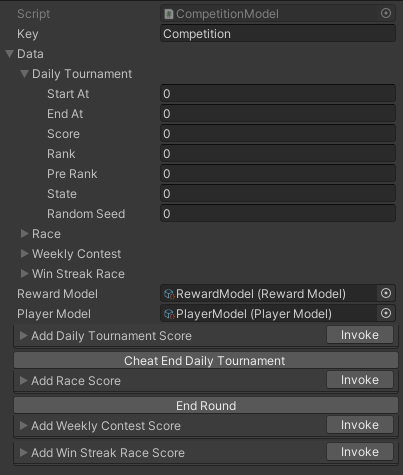

---

## 3. LiveOps Template Project

Để hình dung luồng hoạt động của một dự án hoàn chỉnh tích hợp RCore và SheetX, tham khảo **LiveOps Template**:

🔗 **Repository:** https://gitlab.ikameglobal.com/hungnb/liveopstemplate.git

### 3.1. Initialization Setup

Cấu trúc khởi tạo game với `MasterGroup` (DontDestroyOnLoad), bao gồm `DBManager`, `AudioPlayer`, `AdsProvider`, và các system managers:

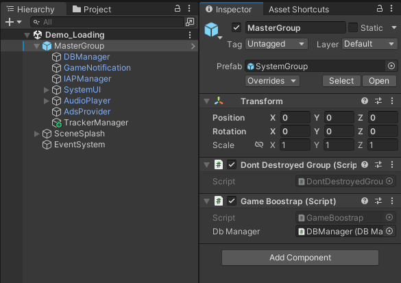

### 3.2. Data Config Setup

#### Nguồn dữ liệu Google Sheets

- [Sheet 1 — Game Config](https://docs.google.com/spreadsheets/d/1jCQW_d-aWwK5TxQDRt1DCFIvN-cAT-AgetpvB2fd0oQ/edit?gid=199486131#gid=199486131)
- [Sheet 2 — LiveOps Config](https://docs.google.com/spreadsheets/d/1RnjqCJIGjpDCiO6qm2WgwDvh8JUmceE6EXYmALVwoxo/edit?gid=0#gid=0)

#### SheetX Export Setup

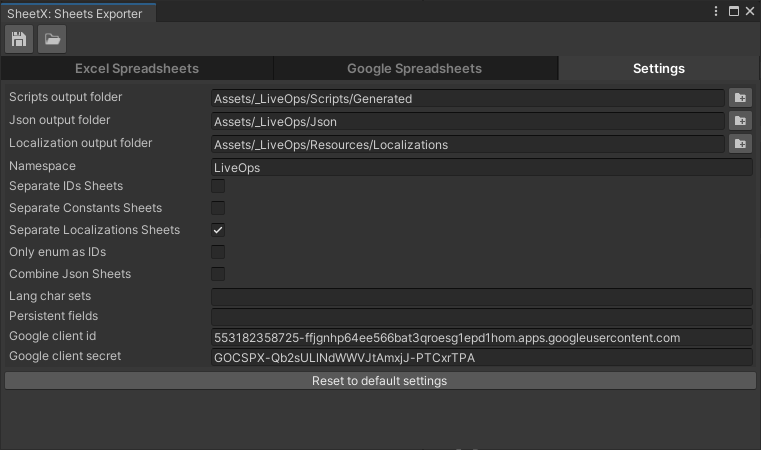

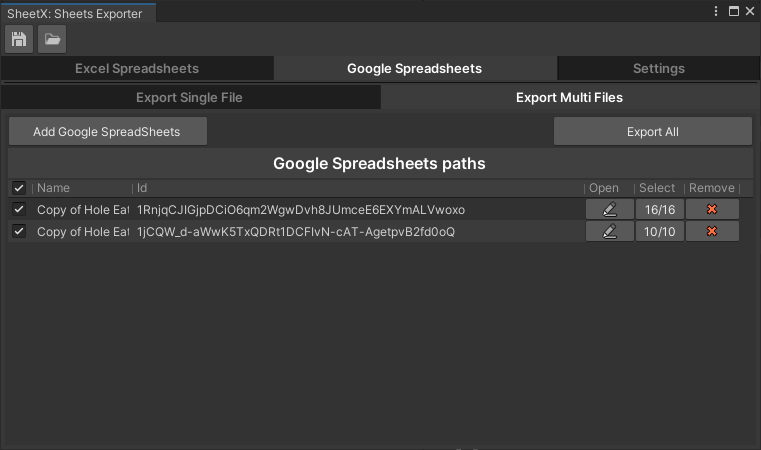

#### Thư mục kết quả sau khi Export

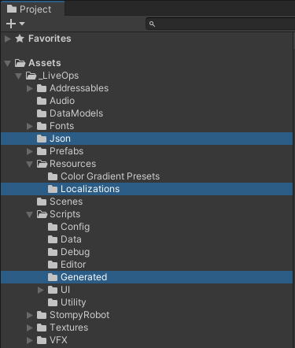

### 3.3. Dynamic Data Setup

Cấu hình `SaveDataCollection` và các `JObjectModel`:

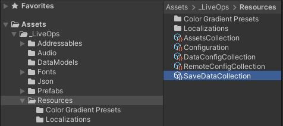

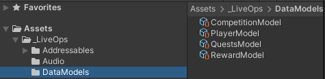

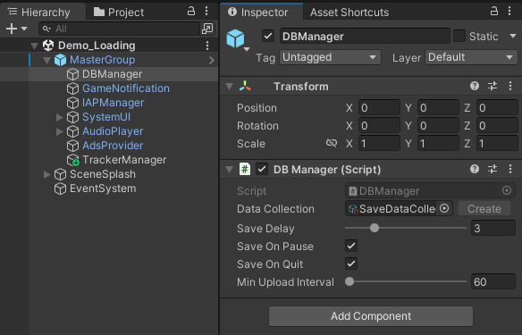

### 3.4. UI System

Panel System phân cấp với quản lý stack-based:

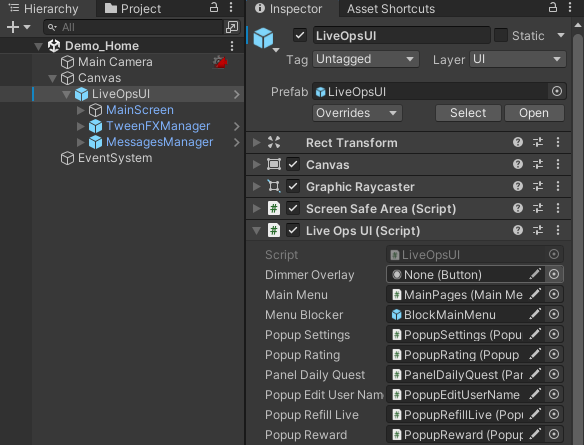

### 3.5. Audio System

Hệ thống âm thanh tập trung với `AudioCollection` và auto-generated `SfxIDs`:

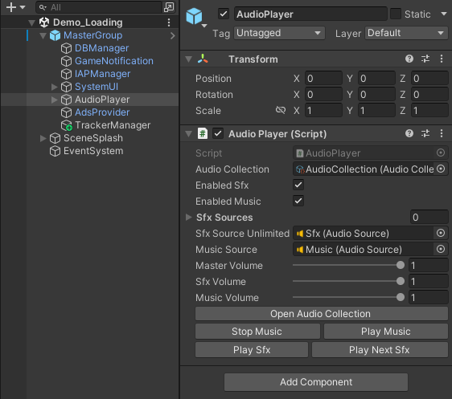

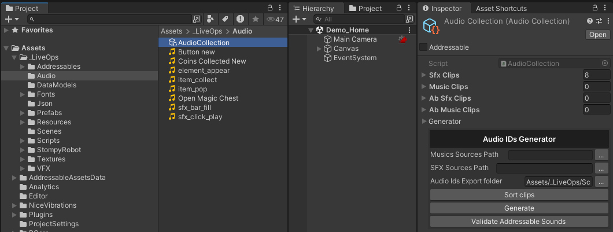

### 3.6. Live-Ops Template Features

Template bao gồm các tính năng Live-Ops phổ biến, mỗi feature được xây dựng theo kiến trúc phân lớp:

| Nhóm | Tính năng |
|---|---|
| **Store** | Store, Special Offers (Beginner/No-Ads/Skin/Disco), Piggy Bank |
| **Reward** | Daily Bonus, Star Chest, Level Chest, Free Reward |
| **Quest** | Daily Quest, Rocket Rush, Collection, Pinata |
| **Competition** | Race, Volcano Quest, Global Leaderboard, Weekly Contest, Daily Tournament |
| **Other** | Settings, Rating, User Profile, Skin Store |

> ⚠️ **Lưu ý:** Nội dung chi tiết từng feature đang được cập nhật. Vui lòng tham khảo trực tiếp source code trong Repository.

---

## Tổng Kết

**Bạn đã học được gì từ tài liệu này:**

| Bước | Nội dung | Kết quả |
|:---:|---|---|
| 1 | Cài đặt RCore + SheetX + UniTask | Môi trường phát triển sẵn sàng |
| 2 | Thiết kế Sheets → Export → ConfigCollection | **Static Config Data** hoàn chỉnh |
| 3 | Tạo DataModel → DataHandler → SaveCollection → DBManager | **Dynamic Player Data** hoàn chỉnh |
| 4 | Sử dụng JObjectDB Editor để debug | Công cụ hỗ trợ development |

**Bước tiếp theo:**
- Đọc [**Architecture**](project_architect) để hiểu cách các lớp phối hợp với nhau.
- Đọc [**SheetX**](sheetx) để tìm hiểu các kiểu dữ liệu nâng cao (Array, JSON, Attribute).
- Đọc [**RCore**](rcore) để khám phá các hệ thống khác: Audio, UI Panel, Event Dispatcher, Module Factory.
- Clone **LiveOps Template** để thực hành với dự án mẫu.