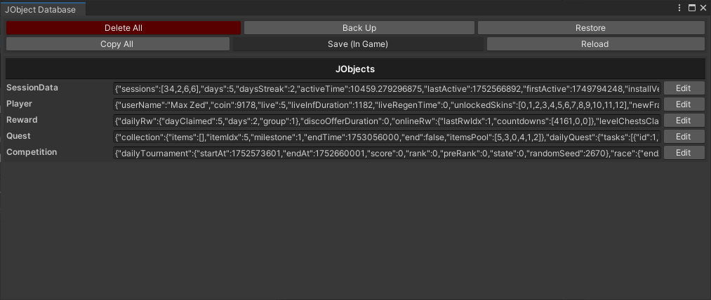

# RCore Framework

## Tổng quan

RCore là một framework Unity được thiết kế để cung cấp hỗ trợ nền tảng cho việc phát triển game. Nó không hướng tới mục tiêu trở thành một giải pháp mạnh mẽ, toàn diện; thay vào đó, nó tập trung vào một tập hợp các hệ thống và lớp tiện ích thiết yếu để hợp lý hóa các tác vụ phát triển phổ biến.

### Các Tính năng Cốt lõi

*   Quản lý `Module` động
*   Hệ thống `Audio` tích hợp
*   Quản lý Dữ liệu linh hoạt
*   Các `UI Components` được tối ưu hóa
*   Tích hợp `Service` (Ads, Firebase, IAP)
*   Các `Editor Tools` hỗ trợ phát triển

## Installation

Để cài đặt, hãy thêm các Git URL sau vào Unity Package Manager (UPM) bằng cách chọn "Add package from git URL...":

1.  **UniTask** (Thư viện phụ thuộc - Dependency)
    ```
    https://github.com/Cysharp/UniTask.git?path=src/UniTask/Assets/Plugins/UniTask
    ```
2.  **RCore**
    ```
    https://github.com/hnb-rabear/RCore.git?path=Assets/RCore/Main
    ```

---

## 1. Core Systems

Phần này chứa các hệ thống nền tảng của `framework`.

### 1.1. Configuration System

*   `Configuration.cs`: Một `ScriptableObject` singleton quản lý cấu hình toàn cục của ứng dụng. Nó cung cấp một hệ thống cho các `environments` và `directives` để xử lý các thiết lập `build` khác nhau, lưu trữ dữ liệu cấu hình dưới dạng cặp `key-value`, và tự động thiết lập `culture info` khi game khởi động.

### 1.2. Audio System

*   `BaseAudioManager.cs`: Một lớp `abstract base` cho hệ thống âm thanh. Các tính năng bao gồm `volume control` (master, music, SFX), hiệu ứng `fade in/out`, hỗ trợ `music playlist`, và `SFX pooling/limiting` để tối ưu hóa hiệu suất.
*   `AudioManager.cs`: Một `singleton` của `BaseAudioManager` với hành vi `DontDestroyOnLoad`, cung cấp một điểm truy cập toàn cục. Nó tự động lắng nghe các sự kiện UI SFX từ `EventDispatcher` để phát các âm thanh tương ứng.
*   `AudioCollection.cs`: Một `ScriptableObject` chứa các bộ sưu tập `AudioClips` cho music và SFX. Nó hỗ trợ tải `asset` động qua `Addressable Assets` và bao gồm một `script generator` để tự động tạo ID âm thanh từ cấu trúc thư mục.
*   `SfxSource.cs`: Một `component` `MonoBehaviour` để phát SFX với các thiết lập cho `loop`, `pitch randomization`, và `volume control`. Nó có thể được sử dụng độc lập hoặc tích hợp với `AudioManager`.
*   `StandaloneAudioManager`:
*   `AudioIDsTemplate`:

### 1.3. Event System

*   `EventDispatcher.cs`: Một lớp `static` cung cấp hệ thống sự kiện tập trung sử dụng `type-safe delegates`. Nó hỗ trợ `AddListener`, `RemoveListener`, và `Raise events`, đồng thời bao gồm chức năng `debounce` để ngăn chặn việc spam sự kiện và đảm bảo các hoạt động `thread-safe`.

### 1.4. Scene Management

*   `SceneLoader.cs`: Một lớp `static utility` để load và unload các `scene` một cách bất đồng bộ (`asynchronously`). Nó cung cấp `progress tracking`, `completion callbacks`, mô phỏng `fixed load time`, và hỗ trợ `additive loading`.

### 1.5. Module Factory System

*   `ModuleFactory.cs`: Một lớp `static factory` để tạo và quản lý các `IModule instances` bằng `reflection` và `attributes`. Nó tự động phát hiện các module được đánh dấu bằng `ModuleAttribute` và tạo chúng dựa trên một `load order` (thứ tự tải) đã xác định. Lưu ý: Nó không thể tạo các module kế thừa từ `MonoBehaviour`.
*   `ModuleManager.cs`: Quản lý `lifecycle` (vòng đời) của tất cả các module đã đăng ký.
*   `ModuleAttribute.cs`: Một `attribute` được sử dụng để đánh dấu một lớp là một module.

### 1.6. Data Config Management

*   `ConfigCollection.cs`: Một lớp `abstract ScriptableObject base` để tải dữ liệu cấu hình từ các file text (chủ yếu là `JSON`). Nó hỗ trợ tải từ các thư mục `Resources` hoặc trực tiếp từ `AssetDatabase` trong Editor.
*   Nên sử dụng kết hợp với `SheetX`.

---

## 2. Data Systems

### 2.1. JObjectDB System



Một hệ thống dựa trên `JSON` được thiết kế để xử lý dữ liệu game với các cấu trúc linh hoạt.

*   `JObjectDB.cs`: Lớp `static` chính cho hệ thống lưu trữ. Cung cấp các phương thức để tạo, lưu, tải, xóa, `backup`, và `restore` các `collection` dữ liệu. Nó sử dụng `PlayerPrefs` làm `storage backend` và hỗ trợ `import/export` dữ liệu JSON.
*   `JObjectData.cs`: Một lớp `abstract base` cho tất cả các `data models`. Nó cung cấp các phương thức để `serializing/deserializing` JSON (hỗ trợ cả `JsonUtility` và `Newtonsoft.Json`), lưu/tải, và xóa dữ liệu.
*   `JObjectDBManagerV2.cs`: Một `abstract MonoBehaviour` quản lý một `JObjectModelCollection` với các tính năng `auto-save` nâng cao (theo độ trễ, khi tạm dừng/thoát game) và quản lý vòng đời dữ liệu.
*   `JObjectModel.cs`: Một `abstract ScriptableObject` đại diện cho một `data model` cụ thể. Nó xử lý các `lifecycle events` như `Init`, `OnPause`, `OnPostLoad`, `OnUpdate`, và `OnPreSave`.
*   `JObjectModelCollection.cs`: Một `ScriptableObject` quản lý một bộ sưu tập các `JObjectModel` instances. Nó cung cấp các phương thức để `Load`, `Save`, và bao gồm các `editor tools` để quản lý dữ liệu.

---

## 3. Common Utilities

### 3.1. Helper Classes

*   `AddressableHelper.cs`: Cung cấp các `utilities` và `wrapper classes` để đơn giản hóa việc làm việc với `Unity Addressables system`. Hỗ trợ `async/await`, `coroutines`, kiểm tra `download size`, và quản lý vòng đời của `asset`.
*   `CameraHelper.cs`: Các `Extension methods` cho lớp `Camera` để chuyển đổi tọa độ, tính toán kích thước camera, và kiểm tra khả năng hiển thị của đối tượng.
*   `ColorHelper.cs`: Các `Extension methods` cho struct `Color` để thao tác `alpha`, `invert` (đảo ngược) màu, và thực hiện các phép toán màu cơ bản khác.
*   `ComponentHelper.cs`: Các `Extension methods` cho các `Component` của Unity, chẳng hạn như sắp xếp `SpriteRenderers` theo `sorting order` và thao tác `alpha` của một UI `Image`.
*   `JsonHelper.cs`: Các `Utilities` để `serializing/deserializing` các mảng và danh sách JSON bằng `JsonUtility` của Unity.
*   `MathHelper.cs`: Cung cấp các hàm toán học mở rộng và các `extension methods` cho `Vector3`, `int`, và `float`.
*   `RandomHelper.cs`: Các `Utilities` để tạo số ngẫu nhiên và `shuffling` (xáo trộn) các bộ sưu tập.
*   `TimeHelper.cs`: Các `Utilities` để định dạng thời gian, chuyển đổi `Unix timestamps`, và các tính toán khác liên quan đến thời gian.
*   `TransformHelper.cs`: Các `Extension methods` cho `Transform` và `RectTransform` để thao tác vị trí, `scale`, và `rotation` một cách thuận tiện.

### 3.2. Pool System

*   `CustomPool.cs`: Một hệ thống `generic object pooling` được thiết kế để tái sử dụng các đối tượng và cải thiện hiệu suất bằng cách giảm các hoạt động `spawn/despawn` thường xuyên.
*   `PoolsContainer.cs`: Một `container` quản lý tập trung nhiều `object pools` khác nhau, hoạt động như một `factory` kết hợp với object pooling.

### 3.3. Timer System

*   `TimerEvents.cs`: Một lớp `MonoBehaviour` quản lý các `timer events` khác nhau, bao gồm các sự kiện `countdown`, `condition`, và `delayable`. Hỗ trợ cả `scaled` và `unscaled` time.
*   `TimerEventsGlobal.cs`: Một phiên bản `singleton` của `TimerEvents` tồn tại qua các lần tải `scene` (`DontDestroyOnLoad`). Nó cung cấp một `execution queue` để chạy các hành động một cách `thread-safe` từ các luồng nền.
*   `TimedAction.cs`: Một lớp đơn giản để thực thi một hành động sau một khoảng thời gian xác định, với một `callback` `onFinished`.

### 3.4. Big Number System

*   `BigNumberD.cs`: Đại diện cho các số lớn sử dụng `decimal` làm kiểu dữ liệu cơ sở để có độ chính xác cao.
*   `BigNumberF.cs`: Đại diện cho các số lớn sử dụng `float` làm kiểu dữ liệu cơ sở để có hiệu suất tốt hơn. Hỗ trợ chuyển đổi sang `notation string` (ví dụ: 1.23E+45) và `KKK format` (ví dụ: 1.23AA).
*   `BigNumberHelper.cs`: Một lớp `static` với các `utility methods` để định dạng và hiển thị các số lớn một cách thân thiện với người dùng.

---

## 4. Hệ thống UI

### 4.1. Panel System

*   `PanelController.cs`: Một lớp `abstract base` cho tất cả các UI `panels`. Nó quản lý `lifecycle` (`Show`, `Hide`, `Back`) và các `animation effects` (hiệu ứng hoạt ảnh) qua `coroutines`.
*   `PanelStack.cs`: Quản lý một `stack` (ngăn xếp) các `PanelControllers`. Nó hỗ trợ các `push modes` khác nhau (`OnTop`, `Replacement`, `Queued`), một `caching system`, và điều hướng `panel`.
*   `PanelRoot.cs`: `Root container` cho toàn bộ hệ thống UI. Nó quản lý `panel queue` (hàng đợi panel), `dimmer overlay` (lớp phủ làm mờ) cho các `modal panel`, và `event-driven panel pushing`.

### 4.2. UI Components

*   `JustButton.cs`: Một lớp `Button` mở rộng với hiệu ứng `scale bounce`, hiệu ứng `greyscale` khi bị vô hiệu hóa, và hiệu ứng âm thanh khi nhấp.
*   `SimpleTMPButton.cs`: Kế thừa từ `JustButton` và thêm hỗ trợ cho nhãn `TextMeshPro` với các tính năng `font color/material swap`.
*   `ProgressBar.cs`: Một `UI component` đa năng để hiển thị các thanh tiến trình, hỗ trợ các chế độ `fill` khác nhau, hiển thị đếm ngược thời gian, và văn bản phần trăm.
*   `ScreenSafeArea.cs`: Một `component` tự động điều chỉnh một `RectTransform` để vừa với vùng an toàn của màn hình, tính đến các `notch` (tai thỏ) và cạnh cong của thiết bị.
*   `HorizontalAlignment.cs`, `VerticalAlignment.cs`, `TableAlignment.cs`: Các `component` căn chỉnh tự động sắp xếp các đối tượng con theo chiều ngang, chiều dọc, hoặc trong một bố cục `grid` (lưới), với hỗ trợ hoạt ảnh.
*   `OptimizedScrollView.cs`, `OptimizedVerticalScrollView.cs`, `OptimizedHorizontalScrollView.cs`: Các triển khai `ScrollView` được tối ưu hóa hiệu suất, sử dụng `object pooling` để chỉ `render` các mục có thể nhìn thấy trong `viewport`.
*   ...

---

## 5. Services Integration

*   **Ads System**: `AdsProvider.cs` (base), `AdmobProvider.cs`, `ApplovinProvider.cs`, `IronSourceProvider.cs`.
*   **Firebase Integration**: `RFirebase.cs` (core), `RFirebaseAnalytics.cs`, `RFirebaseAuth.cs`, `RFirebaseDatabase.cs`, `RFirebaseFirestore.cs`, `RFirebaseRemote.cs`, `RFirebaseStorage.cs`.
*   **Game Services**: `GameServices.cs` (core), `GameServices.CloudSave.cs`, `GameServices.InAppReview.cs`, `GameServices.InAppUpdate.cs`.
*   **IAP System**: `IAPManager.cs` để quản lý `In-App Purchases`.
*   **Notification System**: `NotificationsManager.cs`, `GameNotification.cs`, `PendingNotification.cs`.

---

## 6. Editor Tools

### 6.1. Inspector Enhancements

*   `AutoFillAttribute.cs`: Tự động điền các tham chiếu `component` trong Inspector.
*   `ReadOnlyAttribute.cs`: Đặt một trường ở chế độ chỉ đọc trong Inspector.
*   `CommentAttribute.cs`: Thêm các bình luận mô tả vào Inspector.
*   `HighlightAttribute.cs`: Làm nổi bật các trường quan trọng trong Inspector.
*   `CreateScriptableObjectAttribute.cs`
*   `DisplayEnumAttribute.cs`
*   `ExposeScriptableObjectAttribute.cs`
*   `FolderPathAttribute.cs`
*   `SeparatorAttribute.cs`
*   `ShowIfAttribute.cs`
*   `SpriteBoxAttribute.cs`
*   `TagSelectorAttribute.cs`
*   `TMPFontMaterialsAttribute.cs`
*   ...

### 6.2. Development Tools

*   `AssetShortcutsWindow.cs`: Một cửa sổ để truy cập nhanh vào các `asset` thường dùng.
*   `FindComponentReferenceWindow.cs`: Một công cụ để tìm tất cả các tham chiếu đến một `component` cụ thể.
*   `ObjectsFinderWindow.cs`: Một công cụ để tìm kiếm các đối tượng trong `scene` hiện tại.
*   `ScreenshotTaker.cs`: Một tiện ích để chụp ảnh màn hình trong game.
*   `ScenesNavigatorWindow.cs`: Một cửa sổ để điều hướng nhanh giữa các `scene`.
*   `PlayAssetDeliveryFilter.cs`
*   `ToolsCollectionWindow.cs`
*   ...

### 6.3. Reskin Toolkit

*   `FindAndReplaceAssetToolkit.cs`: Một công cụ để tìm và thay thế các `asset` hàng loạt.
*   `SpriteReplacer.cs`: Một công cụ chuyên dụng để thay thế `Sprites`.
*   `FontReplacer.cs`: Một công cụ chuyên dụng để thay thế `Fonts`.
*   `TMPFontReplacer.cs`: Một công cụ chuyên dụng để thay thế các font TextMeshPro.
*   ...